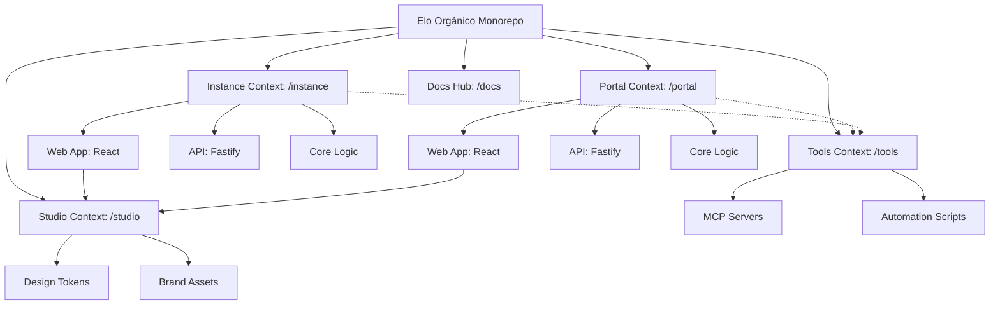

# Bounded Context

We use **PNPM Workspaces** with a **Context-Driven Root** layout to strictly isolate our business domains. This architecture ensures scalability and clear separation of concerns by organizing the codebase into distinct Bounded Contexts at the root.

## Monorepo Structure & Application Roles

The monorepo distinguishes between different core contexts, notably **Portal (Platform)** and **Instance (Community)**. The following diagram illustrates the workspace contexts, package relationships, and dependency flow:

| Directory              | Package Name        | Role          | Responsibility                                                 |
| :--------------------- | :------------------ | :------------ | :------------------------------------------------------------- |
| portal/apps/web        | @elo-portal/web     | **Singleton** | Future SaaS onboarding hub skeleton and platform foundation.   |
| portal/apps/api        | @elo-portal/api     | **Singleton** | Global management API foundation, tenant orchestration.        |
| portal/packages/core   | @elo-portal/core    | **Library**   | SSOT for the global platform foundation.                       |
| instance/services/api  | @elo-instance/api   | **Instance**  | Fastify REST API for a specific community instance.            |
| instance/services/web  | @elo-instance/web   | **Instance**  | React SPA (Admin/Shop) for a specific community instance.      |
| instance/packages/core | @elo-instance/core  | **Library**   | SSOT for community instances (API & Web App).                  |
| studio/                | @elo-studio/assets  | **Tooling**   | Brand tokens, design assets, and global styling.               |
| tools/                 | @elo-organico/tools | **Tooling**   | MCP infrastructure, automation scripts, and project utilities. |
| docs/                  | @elo-organico/docs  | **Docs Hub**  | Official project documentation hub and technical landing page. |

## Bounded Context Philosophy

- **Context Isolation**: Each root directory (`instance/`, `portal/`) represents a Bounded Context. Logic and models are duplicated when necessary to maintain independence, following DDD principles.
- **Deployment**:
  - **Portal**: Designed as a **singleton** layer for future SaaS onboarding. Currently in foundation/skeleton stage.
  - **Docs Hub**: The **authoritative project hub** for documentation (EloDocs) and technical specifications.
  - **Instance**: Multiple pairs of API/Web will be instantiated in the future SaaS model, one for each community.

## Detailed Context Breakdown

### Instance Context (instance/)

Manages community-specific operations (the "Community Shop"). For detailed documentation, see the **[Instance Workspace](/workspaces)**.

- **`@elo-instance/web`**: React SPA (Admin & Shop).
- **`@elo-instance/api`**: Fastify REST API.
- **`@elo-instance/core`**: Domain-specific logic and schemas.

### Portal Context (portal/)

Manages the global platform and SaaS onboarding. For detailed documentation, see the **[Portal Workspace](/workspaces/portal)**.

- **`@elo-portal/web`**: Official landing page and gatekeeper hub.
- **`@elo-portal/api`**: Global orchestration and tenant management API.
- **`@elo-portal/core`**: Platform-specific logic and schemas.

### Studio Context (studio/)

The single source of truth for the project's visual identity and shared UI tokens. For detailed documentation, see the **[Studio Workspace](/workspaces/studio)**.

- **Design Tokens**: Centralized CSS variables and TypeScript constants.
- **Brand Assets**: Canonical logos, icons, and 3D models.
- **AI Orchestration**: System bridge for agentic workflows.

### Tools Context (tools/)

The automation backbone and infrastructure orchestration hub. For detailed documentation, see the **[Tools Workspace](/workspaces/tools)**.

- **MCP Servers**: Model Context Protocol servers (GitHub, Context7, Docker Hub) providing structured context to AI agents.
- **Infrastructure**: Docker configurations and runtime environments for development tools.
- **Automation**: Technical scripts for maintenance, key generation, and workspace health.

### Docs Context (docs/)

The developer documentation hub (EloDocs). For detailed documentation, see the **[Docs Workspace](/workspaces/docs)**.

- **Docusaurus Portal**: Multi-instance documentation sidebar layout.
- **Localization**: Parity between English (`en`) and Portuguese (`pt-BR`) locales.
- **Root Compilation**: Script pipelines generating root-level documentation files.
