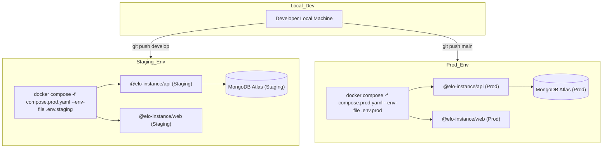

# Deployment Guide

To ensure high availability, security, and reproducible environments, **Elo Orgânico** utilizes a modern, self-hosted deployment model designed for **Hetzner Cloud** virtual machines. This guide outlines our deployment strategy, environment synchronization, and operational procedures.

---

## 1. Environment Topology & Promotion

The architecture is built on the **"Singleton Platform / Multi-Tenant Instance"** model. Each deployment environment consists of a specific runtime boundary:

- **Staging (Homologação):** Mirror of the production stack. Runs on a dedicated subdomain connected to a staging database cluster on MongoDB Atlas. Used to validate new feature sets and schema migrations.
- **Production (Produção):** The authoritative client-facing environment. Fully locked down and optimized for performance.



---

## 2. Build-Time Compilation & Image Packaging

Our frontend and backend deployment units are fully containerized using optimized Dockerfiles.

### 2.1. Frontend Build Arg Injection

Vite statically bakes public environment variables (prefixed with `VITE_`) into the JavaScript bundles during the compilation phase. For this reason, these parameters must be supplied as Docker build arguments during image generation:

```dockerfile
# Inside Frontend Dockerfile
ARG VITE_TURNSTILE_SITE_KEY
ENV VITE_TURNSTILE_SITE_KEY=$VITE_TURNSTILE_SITE_KEY
RUN pnpm build
```

:::warning[Security Boundary]
Never inject sensitive keys (such as JWT secrets, database credentials, or email credentials) into the frontend build. Frontend environments are fully public. All secrets must be kept strictly on the backend API layer and injected at runtime.
:::

---

## 3. Deployment Command Sequences

Deployments are executed directly on the host machine using our unified root CLI scripts.

Check the [Command Reference](../commands-reference.mdx#instance-community) for more start/stop scenarios.

---

## 4. Reverse Proxying & SSL Termination

Elo Orgânico utilizes a reverse proxy setup (either **Nginx** or **Traefik**) to handle TLS termination, compression, and request routing.

- **SSL Certificates:** Managed dynamically via Let's Encrypt using automated ACME challenges.
- **Port Mapping:** The public ports `80` (HTTP) and `443` (HTTPS) map to the edge web containers, which internally forward requests to the Fastify API or serve the compiled static React assets.

:::info[Zero-Downtime Re-Deploys]
Docker Compose automatically updates containers with minimal downtime when executing `pnpm instance:prod` with existing containers. To completely eliminate request dropouts, implement a rolling deployment pattern utilizing an upstream load balancer.
:::

---

## 5. Database Initialization & Schema Migrations

To avoid manual operational overhead during releases, all database preparation is handled dynamically at the application level.

- **Replica Set Configuration:** During local development and initial staging rollouts, the helper container `db-init` automatically ensures the replica set (`rs0`) is established, enabling transaction support.
- **Data Seeding (`SeedPlugin`):** The Fastify server features a natively integrated seeding plugin. On startup, it triggers an idempotent upsert pattern, creating the default administrator user and core static configurations if they do not exist, without risk of duplicate rows.

---

## 6. Logs & Maintenance

`pnpm deploy`: Creates an isolated, pruned Docker context containing only the target app. Used internally inside the CI pipeline or `compose.prod.yaml` files. Read the [Command Reference](../commands-reference.mdx#docker--infrastructure) for more info.

---

_Last Updated: June 2026_
