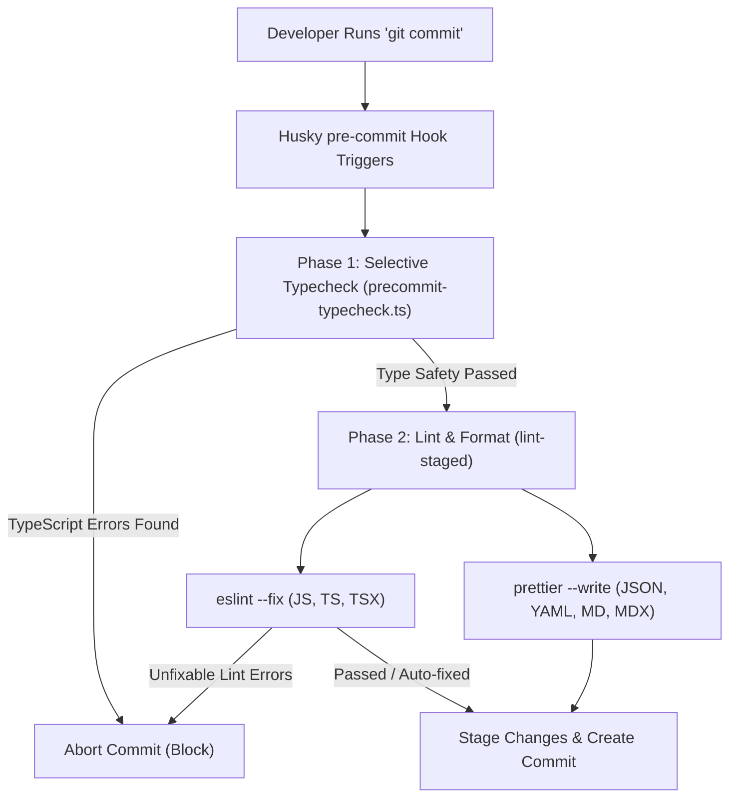

# Commit Validation & CI Hooks

To maintain code quality, styling consistency, and type safety across the **Elo Orgânico** monorepo, we use an automated pipeline that checks all changes before they are committed locally and before they are merged in the cloud.

---

## 1. Local Validation Architecture (Pre-commit)

When you execute a `git commit` command, Git automatically intercepts the action and executes a local validation pipeline. If any step in this pipeline fails, the commit is blocked.

The local validation executes in two sequential phases:



---

## 2. Selective Workspace Typechecking

Running a full typecheck across all monorepo packages (`pnpm typecheck`) can take several seconds. To keep the commit process fast, we use a custom script located at [precommit-typecheck.ts](file:///D:/projects/elo-organico/tools/scripts/precommit-typecheck.ts).

### How it Works

1. The script inspects the currently staged files using `git diff --cached --name-only`.
2. It detects the file extensions: if no JavaScript or TypeScript files have changed, it skips typechecking completely.
3. It maps the changed files to their corresponding monorepo workspaces:
   - Files in `instance/` $\rightarrow$ typecheck `@elo-instance/*` packages.
   - Files in `studio/` $\rightarrow$ typecheck `@elo-organico/studio`.
   - Files in `tools/` $\rightarrow$ typecheck `@elo-organico/tools`.
   - Files in `knowledge-base/` $\rightarrow$ typecheck `@elo-organico/knowledge-base`.
   - Files in `portal/` $\rightarrow$ typecheck `@elo-portal/*`.
4. If global configuration or root files (e.g. `package.json`, `eslint.config.ts`, `pnpm-workspace.yaml`) are modified, the script runs a full typecheck (excluding `portal` until it is updated).
5. It executes the targeted typecheck in parallel using Turborepo filters (e.g., `npx turbo run typecheck --filter=@elo-instance/*`).

:::tip[Performance Advantage]
If you only modify files in the `tools` workspace, only the tools project is typechecked, which takes less than 1.5 seconds. If you only modify documentation (`.md` or `.mdx` files), the typecheck is skipped entirely.
:::

---

## 3. Linting and Formatting (lint-staged)

Once typechecking passes, Husky triggers `lint-staged`, which runs linters and formatters only on the staged files.

### Configuration

The rules are declared in the root [package.json](file:///D:/projects/elo-organico/package.json):

```json
  "lint-staged": {
    "**/*.{js,mjs,ts,tsx}": [
      "eslint --fix"
    ],
    "**/*.{json,yaml,md,mdx}": [
      "prettier --write"
    ]
  }
```

:::note[Prettier Integration]
For JavaScript, TypeScript, and TSX files, we do not run the standalone Prettier CLI. Instead, Prettier runs as an ESLint rule via `eslint-plugin-prettier`. Running `eslint --fix` formats the code according to [.prettierrc.json](file:///D:/projects/elo-organico/.prettierrc.json) and checks for code quality issues in a single execution.
:::

---

## 4. Remote Validation (GitHub Actions CI)

Local Git hooks can be bypassed (e.g. using `git commit --no-verify`). To prevent unvalidated code from reaching stable branches, we run a Continuous Integration (CI) workflow in GitHub on every push and Pull Request.

The workflow configuration is defined in [.github/workflows/ci.yaml](file:///D:/projects/elo-organico/.github/workflows/ci.yaml):

- It installs dependencies using `pnpm install --frozen-lockfile`.
- It executes the full typecheck suite: `pnpm typecheck --filter=!@elo-portal/*`.
- It validates code style and quality: `pnpm lint --filter=!@elo-portal/*`.

:::caution[Branch Protection]
Repository administrators must configure branch protection rules on GitHub for `main` and `develop` branches. Enable the option **Require status checks to pass before merging** and select **Validate Types & Lint** to prevent merging PRs with failing builds.
:::
