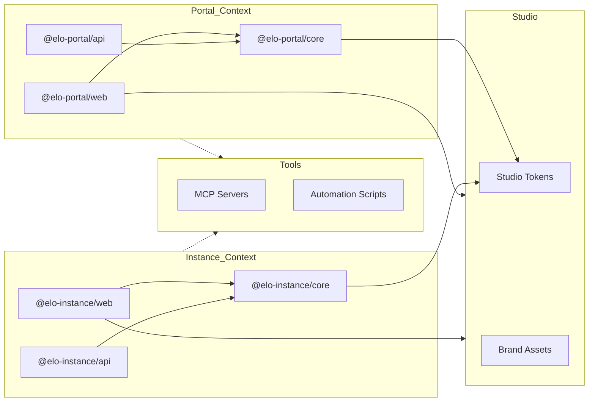

import DocCardList from '@theme/DocCardList';

# Technical Architecture

## 1. Executive Summary

Elo Orgânico is an integrated management platform for organic product sharing cycles. The system is built on a **Monorepo** architecture using **PNPM Workspaces** and **Turborepo**, prioritizing high performance, strict typing, and domain isolation through a **Bounded Context** strategy.

The architecture is designed for a **"Singleton Platform / Multi-Tenant Instance"** model, ensuring that the global marketplace and community-specific operations are logically and physically decoupled at the root level.

---

## 2. Monorepo Structure & Application Roles

The codebase is organized into **Domain Contexts** at the root. We distinguish between **Portal (Platform)** and **Instance (Community)**. The following diagram illustrates the package relationships and dependency flow:



| Directory              | Package Name         | Role          | Responsibility                                                 |
| :--------------------- | :------------------- | :------------ | :------------------------------------------------------------- |
| portal/apps/web        | @elo-portal/web      | **Singleton** | Future SaaS onboarding hub skeleton and platform foundation.   |
| portal/apps/api        | @elo-portal/api      | **Singleton** | Global management API foundation, tenant orchestration.        |
| portal/packages/core   | @elo-portal/core     | **Library**   | SSOT for the global platform foundation.                       |
| instance/apps/api      | @elo-instance/api    | **Instance**  | Fastify REST API for a specific community instance.            |
| instance/apps/web      | @elo-instance/web    | **Instance**  | React SPA (Admin/Shop) for a specific community instance.      |
| instance/packages/core | @elo-instance/core   | **Library**   | SSOT for community instances (API & Web App).                  |
| studio/                | @elo-organico/studio | **Tooling**   | Brand tokens, design assets, and global styling.               |
| tools/                 | @elo-organico/tools  | **Tooling**   | MCP infrastructure, automation scripts, and project utilities. |
| docs/                  | @elo-organico/docs   | **Docs Hub**  | Official project documentation hub and technical landing page. |

### 2.1. Bounded Context Philosophy

- **Context Isolation**: Each root directory (`instance/`, `portal/`) represents a Bounded Context. Logic and models are duplicated when necessary to maintain independence, following DDD principles.
- **Deployment**:
  - **Portal**: Designed as a **singleton** layer for future SaaS onboarding. Currently in foundation/skeleton stage.
  - **Docs Hub**: The **authoritative project hub** for documentation (EloDocs) and technical specifications.
  - **Instance**: Multiple pairs of API/Web will be instantiated in the future SaaS model, one for each community.

---

## 3. Workspace Build & Resolution Strategy

We employ a **Hybrid High-Performance Architecture** optimized by **Turborepo** to manage internal dependencies and task orchestration.

### 3.1. Task Orchestration (Turborepo)

**Turborepo** is the engine behind our monorepo productivity. It handles:

- **Dependency Graph:** Automatically identifying which packages need to be built or checked based on local changes.
- **Infrastructure Coupling:** Orchestrating Docker Compose services as pre-requisites for application development (e.g., `pnpm instance:up` starts databases before the API).
- **Caching:** Speeding up builds, type-checking, and linting by skipping unchanged modules.
- **Unified Outputs:** Standardizing build artifacts into `dist/` (for apps and core) and `build/` (for Docusaurus).

---

## 4. Operational Commands

We use a unified CLI interface defined in the root [package.json](file:///D:/projects/elo-organico/package.json) to orchestrate and manage the monorepo across all environments (**development**, **staging**, and **production**).

For a complete reference list of orchestration scripts, service commands, and dev stack workflows, please refer to the **[Monorepo Orchestration Guide](../../contributing/orchestration.mdx)**.

---

## 5. Architectural Principles

To ensure extreme maintainability, long-term readability, and clean boundaries across our domain contexts, Elo Orgânico follows four foundational architectural principles.

Click on any card below to explore a deep dive into each principle:

<DocCardList
  items={[
    {
      type: 'link',
      href: '/docs/engineering/architecture/principles/solid',
      label: 'SOLID Principles',
      description:
        'Single Responsibility, Open/Closed, Liskov Substitution, Interface Segregation, and Dependency Inversion.',
    },
    {
      type: 'link',
      href: '/docs/engineering/architecture/principles/ssot',
      label: 'Single Source of Truth (SSOT)',
      description:
        'Ensuring that every data element has a single, unambiguous, and authoritative representation.',
    },
    {
      type: 'link',
      href: '/docs/engineering/architecture/principles/inherited-configuration',
      label: 'Inherited Configuration',
      description:
        'Cascading hierarchical settings across workspace contexts to promote reuse and strict defaults.',
    },
    {
      type: 'link',
      href: '/docs/engineering/architecture/principles/ddd-fsd',
      label: 'DDD & Feature-Sliced Design (FSD)',
      description:
        'Applying Domain-Driven Design and Feature-Sliced Design principles for modular and scalable codebase organization.',
    },
  ]}
/>

---

## 6. Technology Stack

### 6.1. Package Management & Orchestration

- **Runtime**: Node.js 22+ (LTS).
- **Package Manager**: PNPM v11 (Strict dependency management via symlinks and hard-link content storage).
- **Dependency Management**: **PNPM Catalogs** (Centralized version control for shared dependencies across the workspace using `catalog:` protocol).
- **Task Orchestrator**: **Turborepo** (Optimized caching and parallel execution).
- **Tooling**: TypeScript 6, ESLint 9 (Flat Config), Prettier 3, Vite 8.

### 6.2. Backend (API Layer)

- **Framework**: Fastify v5 (Optimized for high throughput).
- **ORM/ODM**: Mongoose with MongoDB (Replica Set enabled for ACID transactions).
- **Validation**: Zod (Integrated via domain-specific core packages).
- **Processing**: BullMQ + Redis for asynchronous tasks.

### 6.3. Frontend (UI Layer)

- **Framework**: React 19.
- **State Management**: Zustand (Atomic and performant state using Slices and Selectors).
- **Styling**: TailwindCSS v4 + CSS Modules for scoped styles.
- **Animations**: GSAP (High-fidelity interactive feedback).

---

## 7. Architectural Patterns

### 7.1. Layered Responsibilities (Backend)

Each domain follows a strict hierarchy to isolate concerns:
Controller -> Service -> Repository -> Model

- **Controller**: Handles HTTP I/O, route definitions, and Zod schema validation.
- **Service**: Orchestrates business rules, complex logic, and cross-model transactions.
- **Repository**: Abstracts data persistence logic (Repository Pattern) to keep services database-agnostic.
- **Model**: Defines the Mongoose database structure and data integrity rules.

#### Implementation Example (Repository Pattern)

To maintain strict typing and decoupling, repositories receive the Mongoose model via dependency injection.

```typescript
// instance/apps/api/src/domains/auth/auth.repository.ts
import type { Model } from 'mongoose';
import type { IUser } from '@elo-instance/core';

export class AuthRepository {
  constructor(private readonly userModel: Model<IUser>) {}

  async findByEmail(email: string): Promise<IUser | null> {
    return this.userModel.findOne({ email }).exec();
  }

  async create(data: Partial<IUser>): Promise<IUser> {
    return this.userModel.create(data);
  }
}
```

### 7.2. Frontend State Orchestration (Zustand & FSD)

To prevent monolithic stores and unnecessary re-renders in React 19, the frontend adopts a strict **Atomic Selectors Pattern** coupled with **Domain Hooks**:

1. **State vs. Actions Separation**: The Zustand store separates `state` from `actions`. Pure domain logic (like price calculations) is extracted out of the store to maintain the **Single Source of Truth** and testability.
2. **Atomic Selectors**: Monolithic exports (`export const useAuthStore = create(...)`) are wrapped in specific hooks.
3. **Domain Hooks (`src/domains/*/hooks`)**: Selectors are exposed as individual hooks (e.g., `useAuthUser()`, `useProductActions()`). This ensures that a component only re-renders when the exact slice of state it subscribes to changes.

#### Implementation Example (Zustand Atomic Selectors)

```typescript
// instance/apps/web/src/domains/cart/hooks/useCart.ts
import { useCartStore } from '../cart.store';

// Atomic Selectors
export const useCartItems = () => useCartStore((state) => state.items);
export const useCartActions = () => useCartStore((state) => state.actions);

// Derived State Selector (Never stored in state)
export const useCartTotal = () =>
  useCartStore((state) => state.items.reduce((acc, item) => acc + calculateItemPrice(item), 0));
```

### 7.3. Dependency Injection

Modular management through Fastify decorators and a centralized registry to decouple components and facilitate testing.

---

## 8. Infrastructure & Deployment

Designed for **Self-Hosted Excellence** on Hetzner Cloud.

### 8.1. Docker Compose Strategy (Dev vs. Production)

Each bounded context (`instance/`, `portal/`) maintains two distinct Compose files with clearly separated responsibilities:

| File                | Environment          | Services                    | Database               |
| :------------------ | :------------------- | :-------------------------- | :--------------------- |
| `compose.dev.yaml`  | Development          | MongoDB Replica Set + Redis | Local Docker container |
| `compose.prod.yaml` | Production & Staging | API + Web/Nginx + Redis     | MongoDB Atlas (cloud)  |

**Development flow:**

```
pnpm instance:up   →  compose.dev.yaml starts [MongoDB, Redis] in Docker
pnpm instance:dev  →  API (tsx watch) + Web (vite) run on the host
                       API connects to localhost:27017 (MongoDB in Docker)
                       Web proxies /api → localhost:3000 (via Vite proxy)
```

**Production flow:**

```
pnpm instance:prod  →  compose.prod.yaml --env-file .env.prod builds and starts:
                          [Nginx:80] → [instance-api:3000] → [Redis (internal)]
                                              ↕
                                   [MongoDB Atlas (cloud)]

pnpm instance:staging  →  compose.prod.yaml --env-file .env.staging (same topology)
```

The `compose.prod.yaml` has no MongoDB service by design. In production and staging, the API connects to a cloud-hosted MongoDB Atlas cluster via URI injected from the environment-specific `.env.prod` or `.env.staging` file.

#### 8.1.1. Project and Container Naming Conventions

To prevent naming collisions on hosts that run multiple stacks or environments concurrently (such as staging and production on the same server), the following conventions are enforced:

- **Project Names**: Dev compose files define `name: elo-[context]-dev` (e.g., `elo-instance-dev`), while production/staging compose files define `name: elo-[context]-prod` (e.g., `elo-instance-prod`).
- **Dev Environments**: Container names carry an explicit `-dev` suffix (e.g., `elo-instance-redis-dev`, `elo-instance-db-dev`).
- **Staging vs. Production**: Production/staging containers dynamically append the environment name suffix using the `APP_ENV` variable (e.g., `container_name: elo-instance-redis-${APP_ENV:-prod}`). This isolates the containers at the Docker host daemon level, allowing staging and production containers to coexist on the same virtual machine without collisions.

#### 8.1.2. Why Production and Staging Share a Single Compose File

The decision to use one `compose.prod.yaml` for both production and staging is a deliberate architectural choice, not a simplification shortcut. The rationale is grounded in the **Single Responsibility Principle (SRP)**:

A Compose file should have exactly one reason to change: a **change in stack topology** (new services, different network configuration, altered healthcheck intervals, additional containers). Neither production nor staging requires a different service topology — both run the identical set of services (API, Web/Nginx, Redis) connected to the identical network and with the identical healthcheck strategy.

The only differences between the two environments are **configuration values** (MongoDB Atlas cluster URI, Cloudflare Turnstile keys, API secrets, image tags). This is a configuration concern, not a topology concern, and is the sole responsibility of the environment-specific `.env` files (`.env.prod`, `.env.staging`).

Creating a separate `compose.staging.yaml` as a structural copy of `compose.prod.yaml` would violate SRP by introducing two files with the same reason to change. Any future topology change (adding a monitoring sidecar, updating healthcheck intervals) would require identical edits in both files, creating a drift risk. The correct segregation level is the `--env-file` flag, which is the Docker-sanctioned mechanism for environment-specific configuration injection.

### 8.2. Dockerfile Architecture

Each application owns its `Dockerfile` co-located within its directory, following the **Single Responsibility** and **Bounded Context** principles:

```
instance/apps/api/Dockerfile    # Multi-stage: turbo prune → build → pnpm deploy → runner
instance/apps/web/Dockerfile    # Multi-stage: turbo prune → vite build → nginx:alpine
portal/apps/api/Dockerfile      # Same pattern as instance/api
portal/apps/web/Dockerfile      # Same pattern as instance/web
```

Shared infrastructure services (MongoDB, Redis) have their Dockerfiles in `instance/infrastructure/` because they are cross-app concerns, not owned by any single application.

The API Dockerfiles use **Turborepo pruning** (`turbo prune`) and **`pnpm deploy`** to produce minimal images — no source code, no devDependencies, no monorepo symlinks in production.

The Web Dockerfiles use a two-stage build: a Node.js builder compiles the React SPA via Vite (with `VITE_*` variables injected as Docker `ARG`), and the final stage serves the static output from `nginx:alpine` (~25MB image).

### 8.3. Environment Variable Strategy

Environment variables follow the **Bounded Context** and **Single Responsibility** principles — each file has exactly one owner and lives alongside it:

| File Pattern                      | Owner / Target       | Purpose / Scope                                                                         | Git         |
| :-------------------------------- | :------------------- | :-------------------------------------------------------------------------------------- | :---------- |
| `[context]/.env.dev`              | `compose.dev.yaml`   | Dev infrastructure environment and replica set initialization variables (MongoDB/Redis) | ignored     |
| `[context]/.env.prod`             | `compose.prod.yaml`  | Production container build args, network names, and host ports                          | ignored     |
| `[context]/.env.staging`          | `compose.prod.yaml`  | Staging container build args, network names, and host ports                             | ignored     |
| `[context]/apps/api/.env.dev`     | `@elo-[context]/api` | Dev Fastify API runtime configuration (local DB keys, secrets, rate-limit options)      | ignored     |
| `[context]/apps/api/.env.prod`    | `@elo-[context]/api` | Production Fastify API runtime configuration (cloud MongoDB Atlas, prod secrets)        | ignored     |
| `[context]/apps/api/.env.staging` | `@elo-[context]/api` | Staging Fastify API runtime configuration (staging MongoDB Atlas, staging secrets)      | ignored     |
| `[context]/apps/web/.env.dev`     | `@elo-[context]/web` | Dev Vite build-time public parameters (e.g. Turnstile site key)                         | ignored     |
| `[context]/apps/web/.env.prod`    | `@elo-[context]/web` | Production Vite build-time parameters (injected as Docker build ARGs)                   | ignored     |
| `[context]/apps/web/.env.staging` | `@elo-[context]/web` | Staging Vite build-time parameters (injected as Docker build ARGs)                      | ignored     |
| `*.env.*.example`                 | Repository           | Onboarding config templates for each context and application                            | **tracked** |

_Note: In the table above, `[context]` represents either the `instance` or `portal` directory._

`VITE_*` variables (e.g., `VITE_TURNSTILE_SITE_KEY`) are **build-time** only — Vite bakes them statically into the JavaScript bundle during `vite build`. In Docker builds they are passed via `ARG` → `ENV` before the build step runs.

### 8.4. Network & Latency

All components in a deployment stack reside in a private named Docker bridge network (e.g., `elo-instance-network`) for sub-millisecond latency between the API and Redis. The Nginx container is the only service with an external port binding; the API is only reachable via the Nginx reverse proxy on the internal network.

### 8.5. Nginx Configuration

The Web containers (Nginx) handle two concerns:

1. **SPA Routing**: All unknown paths fall back to `index.html` via `try_files $uri $uri/ /index.html`, allowing React Router to handle client-side navigation without 404s on page refresh.
2. **API Reverse Proxy**: Requests to `/api/*` are proxied to the API container using its Docker service name as the hostname (`http://instance-api:3000/`). The trailing slash strips the `/api` prefix before forwarding to Fastify.

### 8.6. Database Naming and Seeding

To maintain strict parity across environments (development, staging, and production), the database connection and seeding architecture are decoupled from the infrastructure layer and handled directly at the application layer.

#### 8.6.1. Database Naming Standardization

The system enforces `elodb` as the canonical database name across all environments. The database connection plugin parses the configured `MONGO_URI` connection string and overrides the database path to `/elodb`. This prevents accidental connection to default databases (such as `test` on MongoDB Atlas) and guarantees that development, staging, and production instances use the correct data store name.

#### 8.6.2. Natively Integrated Seeding (`SeedPlugin`)

Database seeding is integrated into the API application lifecycle via a dedicated Fastify plugin (`seedPlugin.ts`). It triggers during the `onReady` hook of the Fastify server. Because it runs at the application level, it executes automatically in all environments (development, staging, and production).

#### 8.6.3. Idempotent Upsert Strategy

Seeding operations must be completely safe to execute repeatedly without duplicating or corrupting data. The administrative user seeding utilizes an atomic Mongoose `findOneAndUpdate` operation with the following settings:

- **Upsert Filter**: Checks for the existence of a user with the `admin` role.
- **Set On Insert (`$setOnInsert`)**: Writes user fields (email, username, password, icon, role) only if no matching document exists.
- **Idempotency**: If an admin user is already present, the query resolves as a no-op, preventing existing credentials from being overwritten or duplicated on subsequent server restarts.

#### 8.6.4. Infrastructure Separation of Concerns (`db-init`)

In local development (`compose.dev.yaml`), the container `db-init` (formerly `db-seed`) handles replica set initialization only. It awaits MongoDB readiness and executes `rs.initiate()` to configure the single-node replica set (`rs0`) required for transaction support. It does not perform database seeding. All administrative and operational seeding responsibilities belong entirely to the API container.

---

## 9. Studio & Automation (Architecture)

The Studio and Tools workspaces provide the infrastructure for design-to-code alignment, automation pipelines, and AI-assisted engineering.

- **Design Alignment & Assets**: Managed in the **[Studio Workspace](/workspaces/studio)**.
- **AI Contextual Bridge & Automation**: Managed in the **[Tools Workspace](/workspaces/tools)**.

---

## 10. Security Standards

Elo Orgânico follows a multi-layered security strategy. For detailed implementation details, refer to the **[Security Architecture](../security.mdx)** document.

- **Bot Protection**: Integration with Cloudflare Turnstile for all authentication entry points.
- **Brute-Force Mitigation**: IP-based rate limiting and account lockout logic.
- **Strict Typing**: TypeScript Strict Mode enabled project-wide.
- **Build Integrity**: Automated build script approvals via `pnpm.onlyBuiltDependencies`.
- **Data Integrity**: MongoDB Replica Set (`rs0`) for transactional reliability and ACID compliance.
- **Validation**: Strict Zod validation at every entry point (API requests, Environment variables, internal contracts).

---

_Last Updated: June 2026_
