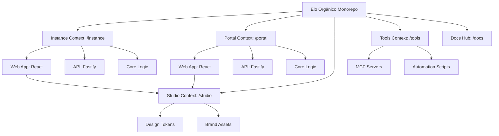

# Introduction

Welcome to the **Elo Orgânico** development environment. This project is a specialized management platform for organic product sharing cycles, built as a high-performance, strictly-typed monorepo.

## Bounded Context Structure

We use **PNPM Workspaces** with a **Context-Driven Root** layout to strictly isolate our business domains. This architecture ensures scalability and clear separation of concerns.



### Instance Context (instance/)

Manages community-specific operations (the "Community Shop"). For detailed documentation, see the **[Instance Workspace](/workspaces)**.

- **`@elo-instance/web`**: React SPA (Admin & Shop).
- **`@elo-instance/api`**: Fastify REST API.
- **`@elo-instance/core`**: Domain-specific logic and schemas.

### Portal Context (portal/)

Manages the global platform and SaaS onboarding. For detailed documentation, see the **[Portal Workspace](/workspaces/portal)**.

- **`@elo-portal/web`**: Official landing page and gatekeeper hub.
- **`@elo-portal/api`**: Global orchestration and tenant management API.
- **`@elo-portal/core`**: Platform-specific logic and schemas.

### Studio Context (studio/)

The single source of truth for the project's visual identity and shared UI tokens. For detailed documentation, see the **[Studio Workspace](/workspaces/studio)**.

- **Design Tokens**: Centralized CSS variables and TypeScript constants.
- **Brand Assets**: Canonical logos, icons, and 3D models.
- **AI Orchestration**: Design bridge for AI context.

### Tools Context (tools/)

The automation backbone and infrastructure orchestration hub. For detailed documentation, see the **[Tools Workspace](/workspaces/tools)**.

- **MCP Servers**: Model Context Protocol servers (GitHub, Context7, Docker Hub) providing structured context to AI agents.
- **Infrastructure**: Docker configurations and runtime environments for development tools.
- **Automation**: Technical scripts for maintenance, key generation, and workspace health.

### Docs Context (docs/)

The developer documentation hub (EloDocs). For detailed documentation, see the **[Docs Workspace](/workspaces/docs)**.

- **Docusaurus Portal**: Multi-instance documentation sidebar layout.
- **Localization**: Parity between English (`en`) and Portuguese (`pt-BR`) locales.
- **Root Compilation**: Script pipelines generating root-level documentation files.

---

## Strategic Focus: Single-Instance Mastery

While architected for a future Multi-tenant SaaS model, our current priority is the **perfect delivery of a standalone community instance (instance/\*)**. All SaaS features in the `portal-*` scope are foundation-only at this stage.

---

## Quick Start

Ensure you have **Node.js 22+**, **PNPM 11+**, and **Docker** installed.

1.  **Install Dependencies:**

    ```bash
    pnpm install
    ```

2.  **Set Up Environment Files:**
    Each bounded context and application has its own environment file. Copy every `.env.*.example` to its non-example counterpart and fill in your local values:

    ```bash
    # Instance infrastructure (for compose.yaml)
    cp instance/.env.dev.example instance/.env.dev

    # Instance API runtime
    cp instance/apps/api/.env.dev.example instance/apps/api/.env.dev

    # Instance Web build-time vars
    cp instance/apps/web/.env.dev.example instance/apps/web/.env.dev
    ```

    Repeat for `portal/` when working on the Portal context.

3.  **Start Local Infrastructure:**
    Spin up the database and cache containers before starting the applications:

    ```bash
    pnpm instance:up   # Starts MongoDB (Replica Set) + Redis for Instance
    ```

4.  **Run Development Environment:**
    With infrastructure running, start the applications:

    ```bash
    pnpm instance:dev       # Starts API (tsx watch) + Web (Vite) for Instance
    pnpm portal:dev         # Starts Portal stack
    ```

    You can also target specific components:

    ```bash
    pnpm docs:dev           # Start Documentation Hub (Docusaurus)
    pnpm instance:web       # Start community Web only
    pnpm instance:api       # Start community API only
    pnpm portal:web         # Start Portal Web only
    pnpm portal:api         # Start Portal API only
    ```

    Refer to the **[Orchestration Reference](./architecture/infra-orchestration-deploy/orchestration.mdx)** for the complete command reference including production deploy commands.

---

## Documentation Index

For detailed guides, please refer to the `docs/` directory:

- **[Architecture Overview](./architecture/overview.mdx)**: Technical stack and monorepo strategy.
- **[Master Plan](./product/masterplan.mdx)**: Project roadmap and phases.
- **[Product Vision](./product/vision.mdx)**: Product mission and value proposition.
- **[Style Guide](./contributing/styleguide.mdx)**: Coding standards and conventions.

---

_Last Updated: June 2026_
