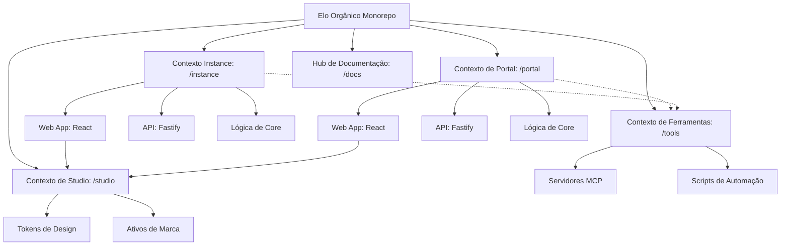

# Contextos Delimitados

Utilizamos **PNPM Workspaces** com um layout de **Context-Driven Root** para isolar estritamente nossos domínios de negócio. Esta arquitetura garante escalabilidade e uma separação clara de responsabilidades organizando a base de código em Contextos Delimitados distintos na raiz.

## Estrutura do Monorepo & Papéis das Aplicações

O monorepo distingue entre diferentes contextos principais, notavelmente **Portal (Plataforma)** e **Instância (Comunidade)**. O diagrama a seguir ilustra os contextos dos workspaces, as relações entre os pacotes e o fluxo de dependências:

| Diretório              | Nome do Pacote       | Papel         | Responsabilidade                                                     |
| :--------------------- | :------------------- | :------------ | :------------------------------------------------------------------- |
| portal/apps/web        | @elo-portal/web      | **Singleton** | Esqueleto do futuro hub de onboarding SaaS e fundação da plataforma. |
| portal/apps/api        | @elo-portal/api      | **Singleton** | Fundação da API de gestão global, orquestração de tenants.           |
| portal/packages/core   | @elo-portal/core     | **Library**   | SSOT para a fundação da plataforma global.                           |
| instance/apps/api      | @elo-instance/api    | **Instância** | API REST Fastify para uma instância de comunidade específica.        |
| instance/apps/web      | @elo-instance/web    | **Instância** | React SPA (Admin/Loja) para uma instância de comunidade específica.  |
| instance/packages/core | @elo-instance/core   | **Library**   | SSOT para instâncias de comunidade (API & Web App).                  |
| studio/                | @elo-studio/assets | **Tooling**   | Tokens de marca, ativos de design e estilização global.              |
| tools/                 | @elo-organico/tools  | **Tooling**   | Infraestrutura MCP, scripts de automação e utilitários de projeto.   |
| docs/                  | @elo-organico/docs   | **Docs Hub**  | Hub oficial de documentação do projeto e landing page técnica.       |

## Filosofia de Contexto Delimitado (Bounded Context)

- **Isolamento de Contexto**: Cada diretório raiz (`instance/`, `portal/`) representa um Bounded Context. Lógica e modelos são duplicados quando necessário para manter a independência, seguindo princípios de DDD.
- **Implantação (Deployment)**:
  - **Portal**: Projetado como uma camada **singleton** para futuro onboarding SaaS. Atualmente em estágio de fundação/esqueleto.
  - **Hub de Documentação**: O **hub oficial do projeto** para documentação (EloDocs) e especificações técnicas.
  - **Instância**: Múltiplos pares de API/Web serão instanciados no futuro modelo SaaS, um para cada comunidade.

## Detalhamento dos Contextos

### Contexto de Instância (instance/)

Gerencia as operações específicas da comunidade (a "Loja da Comunidade"). Para documentação detalhada, consulte o **[Workspace Instance](/workspaces)**.

- **`@elo-instance/web`**: React SPA (Admin & Loja).
- **`@elo-instance/api`**: Fastify REST API.
- **`@elo-instance/core`**: Lógica e esquemas específicos do domínio.

### Contexto de Portal (portal/)

Gerencia a plataforma global e o onboarding do SaaS. Para documentação detalhada, consulte o **[Workspace Portal](/workspaces/portal)**.

- **`@elo-portal/web`**: Landing page oficial e hub de entrada.
- **`@elo-portal/api`**: API de orquestração global e gestão de tenants.
- **`@elo-portal/core`**: Lógica e esquemas específicos da plataforma.

### Contexto de Studio (studio/)

A fonte única de verdade para a identidade visual do projeto e tokens de UI compartilhados. Para documentação detalhada, consulte o **[Workspace Studio](/workspaces/studio)**.

- **Design Tokens**: Variáveis CSS centralizadas e constantes TypeScript.
- **Brand Assets**: Logos canônicos, ícones e modelos 3D.
- **AI Orchestration**: Ponte de sistema para fluxos de trabalho agentic.

### Contexto de Ferramentas (tools/)

A espinha dorsal de automação e hub de orquestração de infraestrutura. Para documentação detalhada, consulte o **[Workspace Tools](/workspaces/tools)**.

- **Servidores MCP**: Servidores Model Context Protocol (GitHub, Context7, Docker Hub) que fornecem contexto estruturado para agentes de IA.
- **Infraestrutura**: Configurações Docker e ambientes de runtime para ferramentas de desenvolvimento.
- **Automação**: Scripts técnicos para manutenção, geração de chaves e saúde do workspace.

### Contexto de Docs (docs/)

O hub de documentação do desenvolvedor (EloDocs). Para documentação detalhada, consulte o **[Workspace Docs](/workspaces/docs)**.

- **Portal Docusaurus**: Layout de barra lateral de documentação multi-instância.
- **Localização**: Paridade entre as localidades Inglês (`en`) e Português (`pt-BR`).
- **Compilação de Raiz**: Pipelines de scripts gerando arquivos de documentação no nível raiz.
