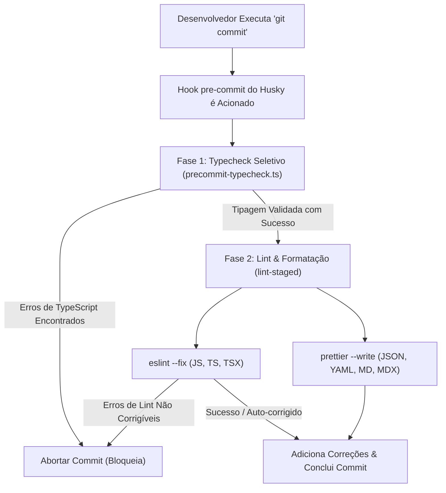

# Validação de Commits & Hooks de CI

Para manter a qualidade do código, a consistência de estilo e a segurança de tipos em todo o monorepo **Elo Orgânico**, utilizamos um fluxo automatizado que valida todas as alterações antes que elas sejam salvas localmente e antes de sofrerem merge na nuvem.

---

## 1. Arquitetura de Validação Local (Pre-commit)

Ao executar o comando `git commit`, o Git intercepta a ação automaticamente e executa um pipeline de validação local. Se qualquer etapa deste pipeline falhar, o commit é impedido.

A validação local executa em duas fases sequenciais:



---

## 2. Validação Seletiva de Tipos por Workspace

Rodar a checagem completa de tipos em todas as aplicações (`pnpm typecheck`) a cada commit pode ser lento. Para otimizar esse fluxo, desenvolvemos um script inteligente em [precommit-typecheck.ts](file:///D:/projects/elo-organico/tools/scripts/precommit-typecheck.ts).

### Como Funciona

1. O script inspeciona os arquivos preparados na staging area usando o comando `git diff --cached --name-only`.
2. Identifica as extensões: se nenhum arquivo de código (JavaScript ou TypeScript) foi alterado, ele pula a checagem de tipos inteiramente.
3. Mapeia os arquivos modificados para seus respectivos pacotes do monorepo:
   - Alterações em `instance/` $\rightarrow$ typecheck de `@elo-instance/*`.
   - Alterações em `studio/` $\rightarrow$ typecheck de `@elo-organico/studio`.
   - Alterações em `tools/` $\rightarrow$ typecheck de `@elo-organico/tools`.
   - Alterações em `knowledge-base/` $\rightarrow$ typecheck de `@elo-organico/knowledge-base`.
   - Alterações em `portal/` $\rightarrow$ typecheck de `@elo-portal/*`.
4. Se arquivos de configuração global ou de raiz (como `package.json`, `eslint.config.ts`, `pnpm-workspace.yaml`) forem alterados, o script executa um typecheck completo (excluindo `portal` temporariamente).
5. Executa as validações filtradas em paralelo utilizando o Turborepo (ex: `npx turbo run typecheck --filter=@elo-instance/*`).

:::tip[Vantagem de Performance]
Se você alterar apenas arquivos do workspace `tools`, somente o projeto `tools` será checado (levando menos de 1,5 segundos). Se alterar apenas documentação (arquivos `.md` ou `.mdx`), a tipagem é ignorada por completo.
:::

---

## 3. Linter e Formatação (lint-staged)

Após o typecheck passar com sucesso, o Husky chama o `lint-staged` para analisar e formatar apenas os arquivos preparados para o commit.

### Configuração

As regras de filtros estão declaradas no arquivo [package.json](file:///D:/projects/elo-organico/package.json) raiz:

```json
  "lint-staged": {
    "**/*.{js,mjs,ts,tsx}": [
      "eslint --fix"
    ],
    "**/*.{json,yaml,md,mdx}": [
      "prettier --write"
    ]
  }
```

:::note[Integração do Prettier]
Para arquivos de código JavaScript e TypeScript, não rodamos o Prettier como ferramenta separada. Ele é executado de forma embutida como uma regra do ESLint (`eslint-plugin-prettier`). Assim, o comando `eslint --fix` formata o arquivo conforme o [.prettierrc.json](file:///D:/projects/elo-organico/.prettierrc.json) e valida as regras de código de uma só vez.
:::

---

## 4. Validação Remota (GitHub Actions CI)

Como os ganchos locais de commit podem ser burlados (usando a flag `--no-verify`), mantemos um workflow de Integração Contínua (CI) na nuvem que valida todas as branches em Pull Requests e pushes diretos.

O workflow de validação está configurado em [.github/workflows/ci.yaml](file:///D:/projects/elo-organico/.github/workflows/ci.yaml):

- Instala as dependências utilizando o `pnpm install --frozen-lockfile`.
- Valida a tipagem completa do monorepo: `pnpm typecheck --filter=!@elo-portal/*`.
- Valida o linter e o estilo de formatação: `pnpm lint --filter=!@elo-portal/*`.

:::caution[Proteção de Branches]
Administradores do repositório devem ativar regras de Branch Protection no GitHub para as branches `main` e `develop`. Marque a opção **Require status checks to pass before merging** e adicione a verificação **Validate Types & Lint** para bloquear merges de PRs que falharem na build.
:::
