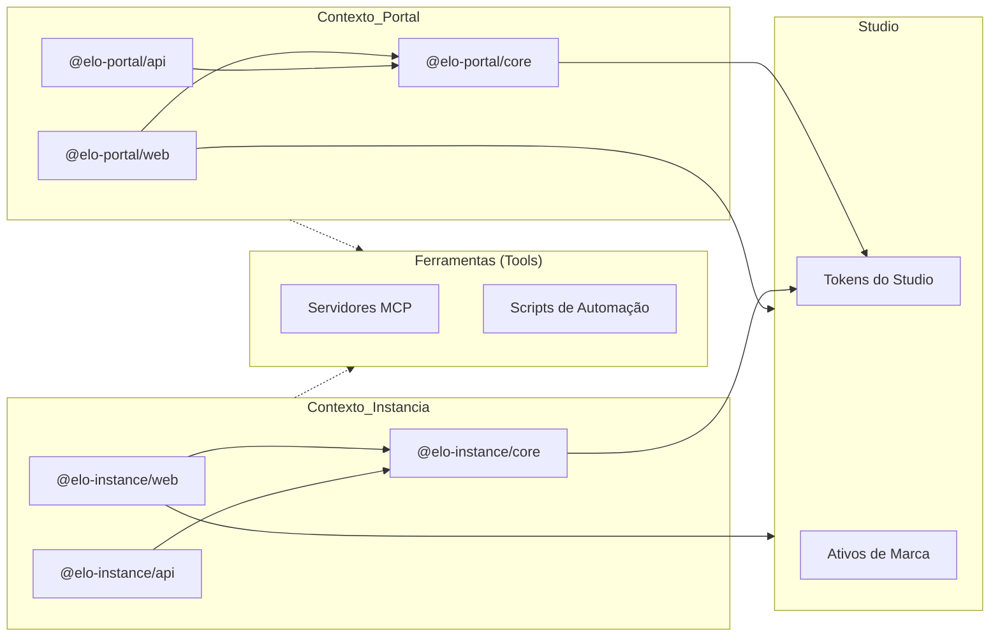

# Arquitetura Técnica

## 1. Resumo Executivo

O Elo Orgânico é uma plataforma de gestão integrada para ciclos de compartilhamento de produtos orgânicos. O sistema é construído sobre uma arquitetura de **Monorepo** utilizando **PNPM Workspaces** e **Turborepo**, priorizando alta performance, tipagem estrita e isolamento de domínio através de uma estratégia de **Contextos Delimitados (Bounded Contexts)**.

A arquitetura é projetada para um modelo de **"Plataforma Singleton / Instância Multi-Tenant"**, garantindo que o marketplace global e as operações específicas de cada comunidade sejam desacoplados lógica e fisicamente no nível raiz.

---

## 2. Estrutura do Monorepo & Papéis das Aplicações

A base de código é organizada em **Contextos de Domínio** na raiz. Distinguimos entre **Portal (Plataforma)** e **Instância (Comunidade)**. O diagrama a seguir ilustra as relações entre os pacotes e o fluxo de dependências:



| Diretório              | Nome do Pacote       | Papel         | Responsabilidade                                                     |
| :--------------------- | :------------------- | :------------ | :------------------------------------------------------------------- |
| portal/apps/web        | @elo-portal/web      | **Singleton** | Esqueleto do futuro hub de onboarding SaaS e fundação da plataforma. |
| portal/apps/api        | @elo-portal/api      | **Singleton** | Fundação da API de gestão global, orquestração de tenants.           |
| portal/packages/core   | @elo-portal/core     | **Library**   | SSOT para a fundação da plataforma global.                           |
| instance/apps/api      | @elo-instance/api    | **Instância** | API REST Fastify para uma instância de comunidade específica.        |
| instance/apps/web      | @elo-instance/web    | **Instância** | React SPA (Admin/Loja) para uma instância de comunidade específica.  |
| instance/packages/core | @elo-instance/core   | **Library**   | SSOT para instâncias de comunidade (API & Web App).                  |
| studio/                | @elo-organico/studio | **Tooling**   | Tokens de marca, ativos de design e estilização global.              |
| tools/                 | @elo-organico/tools  | **Tooling**   | Infraestrutura MCP, scripts de automação e utilitários de projeto.   |
| docs/                  | @elo-organico/docs   | **Docs Hub**  | Hub oficial de documentação do projeto e landing page técnica.       |

### 2.1. Filosofia de Contexto Delimitado (Bounded Context)

- **Isolamento de Contexto**: Cada diretório raiz (`instance/`, `portal/`) representa um Bounded Context. Lógica e modelos são duplicados quando necessário para manter a independência, seguindo princípios de DDD.
- **Implantação (Deployment)**:
  - **Portal**: Projetado como uma camada **singleton** para futuro onboarding SaaS. Atualmente em estágio de fundação/esqueleto.
  - **Hub de Documentação**: O **hub oficial do projeto** para documentação (EloDocs) e especificações técnicas.
  - **Instância**: Múltiplos pares de API/Web serão instanciados no futuro modelo SaaS, um para cada comunidade.

---

## 3. Estratégia de Build e Resolução de Workspace

Empregamos uma **Arquitetura Híbrida de Alta Performance** otimizada pelo **Turborepo** para gerenciar dependências internas e orquestração de tarefas.

### 3.1. Orquestração de Tarefas (Turborepo)

O **Turborepo** é o motor por trás da nossa produtividade no monorepo. Ele lida com:

- **Grafo de Dependências:** Identifica automaticamente quais pacotes precisam de build ou validação com base em alterações locais.
- **Acoplamento de Infraestrutura:** Orquestra serviços do Docker Compose como pré-requisitos para o desenvolvimento das aplicações (ex: `pnpm instance:up` inicia bancos de dados antes da API).
- **Caching:** Acelera builds, type-checking e lints ao ignorar módulos que não foram alterados.
- **Outputs Unificados:** Padroniza artefatos de build em `dist/` (para apps e core) e `build/` (para Docusaurus).

---

## 4. Comandos Operacionais

Utilizamos uma interface de CLI unificada definida no `package.json` raiz para orquestrar e gerenciar o monorepo em todos os ambientes (**desenvolvimento**, **homologação/staging** e **produção**).

Para uma lista de referência completa de scripts de orquestração, comandos de serviço e fluxos de trabalho da stack de desenvolvimento, consulte o **[Guia de Orquestração do Monorepo](../contributing/orchestration.mdx)**.

---

## 5. Princípios Arquiteturais

- **Fonte Única de Verdade (SSOT):** Estruturas de dados da comunidade devem ser definidas em `@elo-instance/core`. Regras da plataforma estão em `@elo-portal/core`.
- **Configuração Herdada:** ESLint e TSConfig são centralizados na raiz, com extensões localizadas fornecendo refinamentos específicos de contexto sem duplicar o rigor base.
- **Domain-Driven Design (DDD) & Feature-Sliced Design (FSD):** A arquitetura frontend combina os contextos delimitados do DDD com a modularidade do Feature-Sliced Design (FSD) para alcançar escala corporativa.
  - **Domínios Globais (`src/domains`):** Contêm entidades (ex: `auth`, `product`, `cycle`), suas stores de estado, clientes de API e **Domain Hooks**.
  - **Features (`src/features`):** Representam fluxos de trabalho de usuários ou módulos de aplicação (ex: `admin`, `shop`). Features orquestram múltiplos domínios, mas são estritamente isoladas umas das outras.
  - **Domínios Privados Específicos de Feature (`src/features/*/domains`):** Subdomínios que só fazem sentido dentro de uma feature específica (ex: `cart` dentro da feature `shop`). Isso previne a poluição do domínio global.
  - **Camada de UI Compartilhada (`src/shared/ui`):** Componentes reutilizáveis e agnósticos de domínio (ex: loaders genéricos, botões). Domínios ou entidades globais **NÃO PODEM** importar de features.
- **Princípios SOLID:**
  - **Responsabilidade Única:** Logic é separada. Stores gerenciam estado, funções puras realizam cálculos e hooks lidam com a orquestração.
  - **Aberto/Fechado:** Aberto para extensão, fechado para modificação.
  - **Substituição de Liskov:** Comportamento consistente de subtipos.
  - **Segregação de Interface:** Interfaces enxutas e específicas.
  - **Inversão de Dependência:** Depender de abstrações, não de concreções.

---

## 6. Stack Tecnológica

### 6.1. Gestão de Pacotes & Orquestração

- **Runtime**: Node.js 22+ (LTS).
- **Gerenciador de Pacotes**: PNPM v11 (Gestão estrita de dependências via symlinks e armazenamento de conteúdo via hard-link).
- **Gestão de Dependências**: **PNPM Catalogs** (Controle de versão centralizado para dependências compartilhadas usando o protocolo `catalog:`).
- **Orquestrador de Tarefas**: **Turborepo** (Cache otimizado e execução paralela).
- **Tooling**: TypeScript 6, ESLint 9 (Flat Config), Prettier 3, Vite 8.

### 6.2. Backend (Camada de API)

- **Framework**: Fastify v5 (Otimizado para alto throughput).
- **ORM/ODM**: Mongoose com MongoDB (Replica Set ativado para transações ACID).
- **Validação**: Zod (Integrado via pacotes core específicos de domínio).
- **Processamento**: BullMQ + Redis para tarefas assíncronas.

### 6.3. Frontend (Camada de UI)

- **Framework**: React 19.
- **Gestão de Estado**: Zustand (Estado atômico e performático utilizando Slices e Selectors).
- **Estilização**: TailwindCSS v4 + CSS Modules para estilos escopados.
- **Animações**: GSAP (Feedback interativo de alta fidelidade).

---

## 7. Padrões Arquiteturais

### 7.1. Camadas de Responsabilidade (Backend)

Cada domínio segue uma hierarquia estrita para isolar preocupações:
Controller -> Service -> Repository -> Model

- **Controller**: Gerencia I/O HTTP, definições de rota e validação de esquemas Zod.
- **Service**: Orquestra regras de negócio, lógica complexa e transações entre modelos.
- **Repository**: Abstrai a lógica de persistência de dados (Repository Pattern) para manter os serviços independentes do banco de dados.
- **Model**: Define a estrutura do banco de dados Mongoose e as regras de integridade de dados.

#### Exemplo de Implementação (Repository Pattern)

Para manter a tipagem estrita e o desacoplamento, os repositórios recebem o modelo Mongoose via injeção de dependência.

```typescript
// instance/apps/api/src/domains/auth/auth.repository.ts
import type { Model } from 'mongoose';
import type { IUser } from '@elo-instance/core';

export class AuthRepository {
  constructor(private readonly userModel: Model<IUser>) {}

  async findByEmail(email: string): Promise<IUser | null> {
    return this.userModel.findOne({ email }).exec();
  }

  async create(data: Partial<IUser>): Promise<IUser> {
    return this.userModel.create(data);
  }
}
```

### 7.2. Orquestração de Estado no Frontend (Zustand & FSD)

Para evitar stores monolíticas e renderizações desnecessárias no React 19, o frontend adota um padrão estrito de **Seletores Atômicos (Atomic Selectors Pattern)** acoplado com **Domain Hooks**:

1. **Separação de Estado e Ações**: A store do Zustand separa o `state` (estado) das `actions` (ações). Lógica de domínio pura (como cálculos de preço) é extraída para fora da store para manter a **Fonte Única de Verdade** e a testabilidade.
2. **Seletores Atômicos**: Exportações monolíticas (`export const useAuthStore = create(...)`) são envelopadas em hooks específicos.
3. **Domain Hooks (`src/domains/*/hooks`)**: Seletores são expostos como hooks individuais (ex: `useAuthUser()`, `useProductActions()`). Isso garante que um componente só seja renderizado novamente quando o pedaço exato de estado ao qual ele se inscreveu for alterado.

#### Exemplo de Implementação (Zustand Atomic Selectors)

```typescript
// instance/apps/web/src/domains/cart/hooks/useCart.ts
import { useCartStore } from '../cart.store';

// Seletores Atômicos
export const useCartItems = () => useCartStore((state) => state.items);
export const useCartActions = () => useCartStore((state) => state.actions);

// Seletor de Estado Derivado (Nunca armazenado no estado)
export const useCartTotal = () =>
  useCartStore((state) => state.items.reduce((acc, item) => acc + calculateItemPrice(item), 0));
```

### 7.3. Injeção de Dependência

Gestão modular através de decoradores do Fastify e um registro centralizado para desacoplar componentes e facilitar testes.

---

## 8. Infraestrutura & Implantação

Projetado para **Excelência Self-Hosted** na Hetzner Cloud.

### 8.1. Estratégia do Docker Compose (Desenvolvimento vs. Produção)

Cada contexto delimitado (`instance/`, `portal/`) mantém dois arquivos Compose distintos com responsabilidades claramente separadas:

| Arquivo             | Ambiente                       | Serviços                    | Banco de Dados         |
| :------------------ | :----------------------------- | :-------------------------- | :--------------------- |
| `compose.dev.yaml`  | Desenvolvimento                | MongoDB Replica Set + Redis | Container Docker local |
| `compose.prod.yaml` | Produção & Homologação/Staging | API + Web/Nginx + Redis     | MongoDB Atlas (nuvem)  |

**Fluxo de desenvolvimento:**

```
pnpm instance:up   →  compose.dev.yaml inicia [MongoDB, Redis] no Docker
pnpm instance:dev  →  API (tsx watch) + Web (vite) rodam no host
                       API se conecta a localhost:27017 (MongoDB no Docker)
                       Web faz proxy de /api → localhost:3000 (via proxy do Vite)
```

**Fluxo de produção:**

```
pnpm instance:prod  →  compose.prod.yaml --env-file .env.prod compila e inicia:
                           [Nginx:80] → [instance-api:3000] → [Redis (interno)]
                                               ↕
                                    [MongoDB Atlas (nuvem)]

pnpm instance:staging  →  compose.prod.yaml --env-file .env.staging (mesma topologia)
```

O `compose.prod.yaml` não possui serviço MongoDB por design. Em produção e homologação/staging, a API se conecta a um cluster MongoDB Atlas hospedado na nuvem via URI injetada a partir do arquivo `.env.prod` ou `.env.staging` específico do ambiente.

#### 8.1.1. Convenções de Nomenclatura de Projetos e Containers

Para evitar colisões de nomes em hosts que executam múltiplas stacks ou ambientes simultaneamente (como homologação/staging e produção no mesmo servidor), as seguintes convenções são aplicadas:

- **Nomes de Projetos**: Os arquivos de compose de desenvolvimento definem `name: elo-[context]-dev` (ex: `elo-instance-dev`), enquanto os arquivos de compose de produção/staging definem `name: elo-[context]-prod` (ex: `elo-instance-prod`).
- **Ambientes de Desenvolvimento**: Os nomes dos containers possuem um sufixo explícito `-dev` (ex: `elo-instance-redis-dev`, `elo-instance-db-dev`).
- **Homologação vs. Produção**: Os containers de produção/staging anexam dinamicamente o sufixo do nome do ambiente usando a variável `APP_ENV` (ex: `container_name: elo-instance-redis-${APP_ENV:-prod}`). Isso isola os containers no nível do daemon do host Docker, permitindo que os containers de staging e produção coexistam na mesma máquina virtual sem colisões.

#### 8.1.2. Por que Produção e Homologação/Staging Compartilham um Único Arquivo Compose

A decisão de usar um único `compose.prod.yaml` para produção e staging é uma escolha arquitetural deliberada, não um atalho de simplificação. A justificativa fundamenta-se no **Princípio de Responsabilidade Única (SRP)**:

Um arquivo Compose deve ter exatamente uma razão para mudar: uma **mudança na topologia da stack** (novos serviços, configuração de rede diferente, intervalos de healthcheck alterados, containers adicionais). Nem a produção nem o staging requerem uma topologia de serviço diferente — ambos executam o conjunto idêntico de serviços (API, Web/Nginx, Redis) conectados à mesma rede e com a mesma estratégia de healthcheck.

As únicas diferenças entre os dois ambientes são **valores de configuração** (URI do cluster MongoDB Atlas, chaves do Cloudflare Turnstile, segredos de API, tags de imagem). Esta é uma preocupação de configuração, não de topologia, e é de responsabilidade exclusiva dos arquivos `.env` específicos de cada ambiente (`.env.prod`, `.env.staging`).

Criar um `compose.staging.yaml` separado como uma cópia estrutural de `compose.prod.yaml` violaria o SRP ao introduzir dois arquivos com o mesmo motivo para mudar. Qualquer alteração futura de topologia (adicionar um container de monitoramento, atualizar intervalos de healthcheck) exigiria edições idênticas em ambos os arquivos, gerando risco de divergência. O nível correto de segregação é a flag `--env-file`, que é o mecanismo recomendado pelo Docker para injeção de configurações específicas de ambiente.

### 8.2. Arquitetura dos Dockerfiles

Cada aplicação possui seu próprio `Dockerfile` localizado dentro do seu respectivo diretório, seguindo os princípios de **Responsabilidade Única** e de **Contexto Delimitado**:

```
instance/apps/api/Dockerfile    # Multi-stage: turbo prune → build → pnpm deploy → runner
instance/apps/web/Dockerfile    # Multi-stage: turbo prune → vite build → nginx:alpine
portal/apps/api/Dockerfile      # Mesmo padrão que instance/api
portal/apps/web/Dockerfile      # Mesmo padrão que instance/web
```

Serviços de infraestrutura compartilhados (MongoDB, Redis) possuem seus Dockerfiles em `instance/infrastructure/` porque são preocupações que cruzam múltiplas aplicações, não pertencendo a nenhuma aplicação individualmente.

Os Dockerfiles de API utilizam a **poda do Turborepo** (`turbo prune`) e o **`pnpm deploy`** para produzir imagens mínimas — sem código-fonte, sem devDependencies e sem symlinks do monorepo em produção.

Os Dockerfiles Web utilizam uma compilação de dois estágios (two-stage build): um construtor Node.js compila o SPA React via Vite (com variáveis `VITE_*` injetadas como `ARG` do Docker) e o estágio final serve os arquivos estáticos a partir do `nginx:alpine` (imagem de aproximadamente 25MB).

### 8.3. Estratégia de Variáveis de Ambiente

Os arquivos de ambiente seguem os princípios de **Contexto Delimitado** e **Responsabilidade Única** — cada arquivo possui exatamente um dono e reside ao lado dele:

| Padrão de Arquivo                 | Dono / Alvo          | Propósito / Escopo                                                                                                      | Git           |
| :-------------------------------- | :------------------- | :---------------------------------------------------------------------------------------------------------------------- | :------------ |
| `[context]/.env.dev`              | `compose.dev.yaml`   | Variáveis de ambiente de infraestrutura de desenvolvimento e inicialização do replica set (MongoDB/Redis)               | ignorado      |
| `[context]/.env.prod`             | `compose.prod.yaml`  | Argumentos de compilação de container de produção, nomes de redes e portas do host                                      | ignorado      |
| `[context]/.env.staging`          | `compose.prod.yaml`  | Argumentos de compilação de container de homologação/staging, nomes de redes e portas do host                           | ignorado      |
| `[context]/apps/api/.env.dev`     | `@elo-[context]/api` | Configuração de execução da API Fastify de dev (chaves locais de banco de dados, segredos, opções de limitador de taxa) | ignorado      |
| `[context]/apps/api/.env.prod`    | `@elo-[context]/api` | Configuração de execução da API Fastify de produção (MongoDB Atlas na nuvem, segredos de produção)                      | ignorado      |
| `[context]/apps/api/.env.staging` | `@elo-[context]/api` | Configuração de execução da API Fastify de homologação (MongoDB Atlas de staging, segredos de homologação)              | ignorado      |
| `[context]/apps/web/.env.dev`     | `@elo-[context]/web` | Parâmetros públicos em tempo de build da Web de dev (ex: chave do site Turnstile)                                       | ignorado      |
| `[context]/apps/web/.env.prod`    | `@elo-[context]/web` | Parâmetros públicos em tempo de build da Web de produção (injetados como build ARGs do Docker)                          | ignorado      |
| `[context]/apps/web/.env.staging` | `@elo-[context]/web` | Parâmetros públicos em tempo de build da Web de homologação (injetados como build ARGs do Docker)                       | ignorado      |
| `*.env.*.example`                 | Repositório          | Modelos de configuração de onboarding para cada contexto e aplicação                                                    | **rastreado** |

_Nota: Na tabela acima, `[context]` representa o diretório `instance` ou `portal`._

As variáveis `VITE_*` (como `VITE_TURNSTILE_SITE_KEY`) são apenas para o **tempo de build (compilação)** — o Vite as grava estaticamente no bundle JavaScript durante o `vite build`. Em builds Docker, elas são transmitidas via `ARG` → `ENV` antes do início da etapa de compilação.

### 8.4. Rede & Latência

Todos os componentes em uma stack de implantação residem em uma rede privada bridge nomeada do Docker (ex: `elo-instance-network`) para latência sub-milissegundo entre a API e o Redis. O container Nginx é o único serviço com um mapeamento de porta externa; a API só é alcançável através do proxy reverso do Nginx na rede interna.

### 8.5. Configuração do Nginx

Os containers Web (Nginx) lidam com duas preocupações principais:

1. **Roteamento SPA**: Todos os caminhos desconhecidos retornam para o `index.html` via `try_files $uri $uri/ /index.html`, permitindo que o React Router gerencie a navegação no lado do cliente sem gerar erros 404 ao atualizar a página.
2. **Proxy Reverso de API**: As requisições para `/api/*` são direcionadas ao container da API usando o nome do seu serviço Docker como hostname (`http://instance-api:3000/`). A barra invertida final remove o prefixo `/api` antes de encaminhar a requisição para o Fastify.

### 8.6. Nomenclatura e Semeadura de Banco de Dados

Para manter paridade estrita entre os diferentes ambientes (desenvolvimento, staging e produção), la conexão de banco de dados e a arquitetura de semeadura (seeding) são desacopladas da camada de infraestrutura e gerenciadas diretamente na camada de aplicação.

#### 8.6.1. Padronização do Nome do Banco de Dados

O sistema impõe `elodb` as o nome canônico do banco de dados em todos os ambientes. O plugin de conexão de banco de dados analisa a string de conexão `MONGO_URI` configurada e substitui o caminho do banco de dados por `/elodb`. Isso evita conexões acidentais a bancos de dados padrão (como `test` no MongoDB Atlas) e garante que as instâncias de desenvolvimento, staging e produção utilizem o nome correto do data store.

#### 8.6.2. Semeadura Integrada Nativamente (`SeedPlugin`)

La semeadura do banco de dados é integrada ao ciclo de vida da aplicação API através de um plugin dedicado do Fastify (`seedPlugin.ts`). Ela é disparada durante o hook `onReady` do servidor Fastify. Como é executada no nível da aplicação, ocorre automaticamente em todos os ambientes (desenvolvimento, staging e produção).

#### 8.6.3. Estratégia de Upsert Idempotente

As operações de semeadura devem ser totalmente seguras para execução repetida sem duplicar ou corromper dados. A semeadura do usuário administrativo utiliza uma operação atômica do Mongoose `findOneAndUpdate` com as seguintes configurações:

- **Filtro de Upsert**: Verifica a existência de um usuário com o papel de `admin`.
- **Set On Insert (`$setOnInsert`)**: Grava os campos do usuário (email, username, password, icon, role) apenas se nenhum documento correspondente for encontrado.
- **Idempotência**: Se um usuário administrador já estiver presente, a consulta é resolvida como um no-op (sem operação), evitando que credenciais existentes sejam sobrescritas ou duplicadas em reinicializações subsequentes do servidor.

#### 8.6.4. Separação de Preocupações na Infraestrutura (`db-init`)

No desenvolvimento local (`compose.dev.yaml`), o container `db-init` (antigo `db-seed`) lida exclusivamente com a inicialização do replica set. Ele aguarda a prontidão do MongoDB e executa `rs.initiate()` para configurar o replica set de nó único (`rs0`) necessário para suporte a transações. Ele não realiza semeadura de banco de dados. Todas as responsabilidades de semeadura administrativa e operacional pertencem inteiramente ao container da API.

---

## 9. Studio & Automação (Arquitetura)

Os workspaces de Studio e Tools fornecem a infraestrutura para o alinhamento entre design e código, pipelines de automação e engenharia assistida por IA.

- **Alinhamento de Design e Ativos**: Gerenciado no **[Workspace Studio](/workspaces/studio)**.
- **Ponte Contextual de IA e Automação**: Gerenciado no **[Workspace Tools](/workspaces/tools)**.

---

## 10. Padrões de Segurança

O Elo Orgânico segue uma estratégia de segurança em múltiplas camadas. Para detalhes detalhados de implementação, consulte o documento de **[Arquitetura de Segurança](./security.mdx)**.

- **Proteção contra Bots**: Integração com Cloudflare Turnstile para todos os pontos de entrada de autenticação.
- **Mitigação de Brute-Force**: Limitação de taxa baseada em IP e lógica de bloqueio de conta.
- **Tipagem Estrita**: Modo Estrito do TypeScript ativado em todo o projeto.
- **Integridade de Build**: Aprovações automatizadas de scripts de build via `pnpm.onlyBuiltDependencies`.
- **Integridade de Dados**: MongoDB Replica Set (`rs0`) para confiabilidade transacional e conformidade ACID.
- **Validação**: Validação rigorosa com Zod em cada ponto de entrada (Requisições API, Variáveis de ambiente, contratos internos).

---

_Última Atualização: Junho de 2026_
