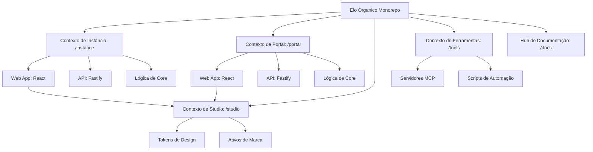

# Introdução

Bem-vindo ao ambiente de desenvolvimento do **Elo Orgânico**. Este projeto é uma plataforma de gestão especializada para ciclos de compartilhamento de produtos orgânicos, construída como um monorepo de alta performance e tipagem estrita.

## Estrutura de Contextos Delimitados (Bounded Contexts)

Utilizamos **PNPM Workspaces** com um layout de **Context-Driven Root** para isolar estritamente nossos domínios de negócio. Esta arquitetura garante escalabilidade e uma separação clara de responsabilidades.



### Contexto de Instância (instance/)

Gerencia as operações específicas da comunidade (a "Loja da Comunidade"). Para documentação detalhada, consulte o **[Workspace Instance](/workspaces)**.

- **`@elo-instance/web`**: React SPA (Admin & Loja).
- **`@elo-instance/api`**: Fastify REST API.
- **`@elo-instance/core`**: Lógica e esquemas específicos do domínio.

### Contexto de Portal (portal/)

Gerencia a plataforma global e o onboarding do SaaS. Para documentação detalhada, consulte o **[Workspace Portal](/workspaces/portal)**.

- **`@elo-portal/web`**: Landing page oficial e hub de entrada.
- **`@elo-portal/api`**: API de orquestração global e gestão de tenants.
- **`@elo-portal/core`**: Lógica e esquemas específicos da plataforma.

### Contexto de Studio (studio/)

A fonte única de verdade para a identidade visual do projeto e tokens de UI compartilhados. Para documentação detalhada, consulte o **[Workspace Studio](/workspaces/studio)**.

- **Tokens de Design**: Variáveis CSS e constantes TypeScript centralizadas.
- **Ativos de Marca**: Logos canônicos, ícones e modelos 3D.
- **Orquestração de IA**: Ponte de design para contexto de IA.

### Contexto de Ferramentas (tools/)

A espinha dorsal de automação e hub de orquestração de infraestrutura. Para documentação detalhada, consulte o **[Workspace Tools](/workspaces/tools)**.

- **Servidores MCP**: Servidores Model Context Protocol (GitHub, Context7, Docker Hub) que fornecem contexto estruturado para agentes de IA.
- **Infraestrutura**: Configurações Docker e ambientes de runtime para ferramentas de desenvolvimento.
- **Automação**: Scripts técnicos para manutenção, geração de chaves e saúde do workspace.

### Contexto de Docs (docs/)

O hub de documentação do desenvolvedor (EloDocs). Para documentação detalhada, consulte o **[Workspace Docs](/workspaces/docs)**.

- **Portal Docusaurus**: Layout de barra lateral de documentação multi-instância.
- **Localização**: Paridade entre as localidades Inglês (`en`) e Português (`pt-BR`).
- **Compilação de Raiz**: Pipelines de scripts gerando arquivos de documentação no nível raiz.

---

## Foco Estratégico: Maestria em Instância Única

Embora arquitetado para um modelo SaaS Multi-tenant futuro, nossa prioridade atual é a **entrega perfeita de uma instância de comunidade autônoma (instance/\*)**. Todas as funcionalidades SaaS no escopo `portal-*` são apenas fundacionais nesta etapa.

---

## Início Rápido

Certifique-se de ter o **Node.js 22+**, **PNPM 11+** e o **Docker** instalados.

1.  **Instalar Dependências:**

    ```bash
    pnpm install
    ```

2.  **Configurar Arquivos de Ambiente:**
    Cada contexto delimitado e aplicação possui seu próprio arquivo de ambiente. Copie cada `.env.*.example` para o seu respectivo arquivo sem a extensão `.example` e preencha com seus valores locais:

    ```bash
    # Infraestrutura de instância (para compose.yaml)
    cp instance/.env.dev.example instance/.env.dev

    # API de instância runtime
    cp instance/apps/api/.env.dev.example instance/apps/api/.env.dev

    # Variáveis de compilação da Web de instância
    cp instance/apps/web/.env.dev.example instance/apps/web/.env.dev
    ```

    Repita para `portal/` quando estiver trabalhando no contexto de Portal.

3.  **Iniciar Infraestrutura Local:**
    Suba os containers de banco de dados e cache antes de iniciar as aplicações:

    ```bash
    pnpm instance:up   # Inicia MongoDB (Replica Set) + Redis para Instância
    ```

4.  **Executar Ambiente de Desenvolvimento:**
    Com a infraestrutura em execução, inicie as aplicações:

    ```bash
    pnpm instance:dev       # Inicia API (tsx watch) + Web (Vite) para Instância
    pnpm portal:dev         # Inicia a stack do Portal
    ```

    Você também pode direcionar componentes específicos:

    ```bash
    pnpm docs:dev           # Inicia o Hub de Documentação (Docusaurus)
    pnpm instance:web       # Inicia apenas a Web da comunidade
    pnpm instance:api       # Inicia apenas a API da comunidade
    pnpm portal:web         # Inicia apenas a Web do Portal
    pnpm portal:api         # Inicia apenas a API do Portal
    ```

    Consulte a **[Referência de Orquestração](./contributing/orchestration.mdx)** para uma lista completa de comandos, incluindo comandos de implantação em produção.

---

## Índice de Documentação

Para guias detalhados, consulte o diretório `docs/`:

- **[Visão Geral da Arquitetura](./engineering/architecture.mdx)**: Stack técnica e estratégia de monorepo.
- **[Plano Mestre](./product/masterplan.mdx)**: Roadmap e fases do projeto.
- **[Visão do Produto](./product/vision.mdx)**: Missão do produto e proposta de valor.
- **[Guia de Estilo](./engineering/styleguide.mdx)**: Padrões de codificação e convenções.

---

_Última Atualização: Junho de 2026_
