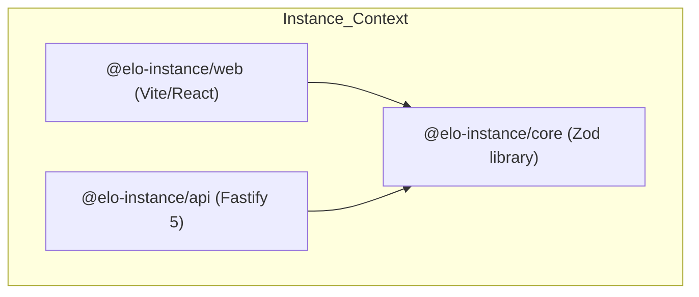

# Bounded Context Context: Instance (Community Stack)

This file defines the domain rules, local stack services, and workspace structure for the community-specific **Instance Bounded Context** (`instance/`).

---

## Bounded Context Navigation

Before editing or analyzing code in this context, read the local rules for the specific workspace:

- **Core Library**: [packages/core/AGENTS.md](./packages/core/AGENTS.md) — Shared types, Zod schemas, and data validation rules.
- **REST API**: [apps/api/AGENTS.md](./apps/api/AGENTS.md) — Fastify 5 route definitions, Mongoose models, and Mapped Repository logic.
- **Web Client**: [apps/web/AGENTS.md](./apps/web/AGENTS.md) — React 19 visual client, Zustand state stores, and fluid CSS styling.
- **Workspace Documentation**: Refer to the community shop documentation in [knowledge-base/workspaces/01-instance.md](../knowledge-base/workspaces/01-instance.md).
- **Workspace Roadmap**: Refer to the community shop roadmap in [knowledge-base/roadmap/02-instance.md](../knowledge-base/roadmap/02-instance.md).

---

## Bounded Context Architecture

The Instance context manages all community-level operations (the "Community Shop"). It is architected for strict domain isolation and scalability.

- **Canonical Database**: The database connection parses Mongoose connection strings and dynamically overrides the database name to **`elodb`** in all environments (development, staging, and production).
- **Integrated Seeding (`SeedPlugin`)**: The initial admin user creation is natively integrated into the Fastify server lifecycle as an idempotent onReady plugin. Local compose scripts only initialize the replica set.
- **State & Action Segregation**: State management in the client strictly separates properties from actions in Zustand stores, exporting atomic selectors.

---

## Context Isolation Guardrails

1. **No Cross-Context Imports**: You MUST NEVER import modules, constants, validation schemas, or helper functions from the `portal/` directory. All shared utilities or assets must be locally duplicated or centralized in global tooling workspaces if permitted.
2. **Catalog Integrity**: All dependencies must declare versions using workspace catalogs (`catalog:web-stack`, `catalog:api-stack`, `catalog:shared-stack`, etc.) defined in `pnpm-workspace.yaml`.

---

## Local Lifecycle Commands

Run these commands from the monorepo root to manage the community stack:

- `pnpm instance:dev`: Boots the local compose databases (MongoDB rs0 + Redis), builds `@elo-instance/core`, and runs `@elo-instance/api` and `@elo-instance/web` concurrently on the host.
- `pnpm instance:up`: Boots only the MongoDB replica set (`elo-instance-db-dev`) and Redis (`elo-instance-redis-dev`) containers.
- `pnpm instance:down`: Stops local Docker containers and releases localhost ports 3000 and 5173.
- `pnpm instance:reset`: Clears local database volumes and rebuilds developer infrastructure containers.
- `pnpm instance:prod`: Builds and launches the production stack (API + Web/Nginx + Redis) using `.env.prod`.
- `pnpm instance:prod:down`: Stops and tears down the production stack.
- `pnpm instance:staging`: Builds and launches the staging stack using `.env.staging`.
- `pnpm instance:staging:down`: Stops and tears down the staging stack.
