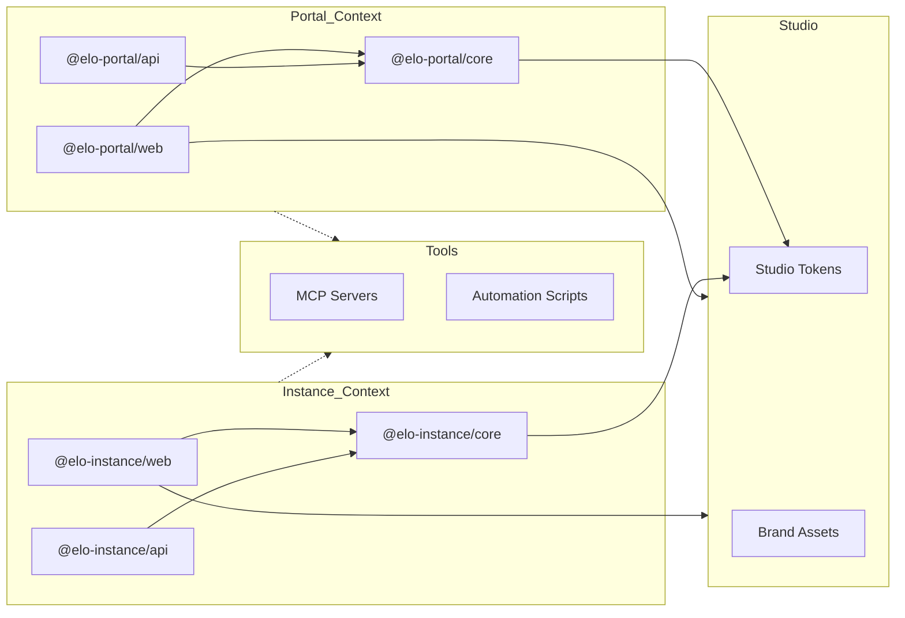

# Technical Architecture

## 1. Executive Summary

Elo Orgânico is an integrated management platform for organic product sharing cycles. The system is built on a **Monorepo** architecture using **PNPM Workspaces** and **Turborepo**, prioritizing high performance, strict typing, and domain isolation through a **Bounded Context** strategy.

The architecture is designed for a **"Singleton Platform / Multi-Tenant Instance"** model, ensuring that the global marketplace and community-specific operations are logically and physically decoupled at the root level.

---

## 2. Monorepo Structure & Application Roles

The codebase is organized into **Domain Contexts** at the root. We distinguish between **Portal (Platform)** and **Instance (Community)**. The following diagram illustrates the package relationships and dependency flow:



| Directory              | Package Name         | Role          | Responsibility                                                 |
| :--------------------- | :------------------- | :------------ | :------------------------------------------------------------- |
| portal/apps/web        | @elo-portal/web      | **Singleton** | Global official portal, landing page, and SaaS onboarding hub. |
| portal/apps/api        | @elo-portal/api      | **Singleton** | Global management API, tenant orchestration, and billing.      |
| portal/packages/core   | @elo-portal/core     | **Library**   | SSOT for the global platform (Portal API & Web).               |
| instance/apps/api      | @elo-instance/api    | **Instance**  | Fastify REST API for a specific community instance.            |
| instance/apps/web      | @elo-instance/web    | **Instance**  | React SPA (Admin/Shop) for a specific community instance.      |
| instance/packages/core | @elo-instance/core   | **Library**   | SSOT for community instances (API & Web App).                  |
| studio/                | @elo-organico/studio | **Tooling**   | Brand tokens, design assets, and global styling.               |
| tools/                 | @elo-organico/tools  | **Tooling**   | MCP infrastructure, automation scripts, and project utilities. |

### 2.1. Bounded Context Philosophy

- **Context Isolation**: Each root directory (`instance/`, `portal/`) represents a Bounded Context. Logic and models are duplicated when necessary to maintain independence, following DDD principles.
- **Deployment**:
  - **Portal**: There is only **one** global instance of the platform. It serves as the face of the project and the gateway for the entire ecosystem.
  - **Instance**: Multiple pairs of API/Web will be instantiated in the future SaaS model, one for each community.

---

## 3. Workspace Build & Resolution Strategy

We employ a **Hybrid High-Performance Architecture** optimized by **Turborepo** to manage internal dependencies and task orchestration.

### 3.1. Task Orchestration (Turborepo)

**Turborepo** is the engine behind our monorepo productivity. It handles:
- **Dependency Graph:** Automatically identifying which packages need to be built or checked based on local changes.
- **Infrastructure Coupling:** Orchestrating Docker Compose services as pre-requisites for application development (e.g., starting databases before the API).
- **Caching:** Speeding up builds and linting by skipping unchanged modules.

### 3.2. Web Applications (Build from Source)

Frontend applications utilize a **"Bundling from Source"** strategy.

- **Mechanism:** Vite 8 leverages native `resolve.tsconfigPaths` to resolve aliases directly to the internal packages' src (e.g., `@elo-instance/core` points to `instance/packages/core/src/index.ts`).
- **Benefits:** Maximum tree-shaking efficiency (Vite optimizes the Core code specifically for the app bundle), instant HMR across the monorepo, and simplified build pipelines.

### 3.2. Backend APIs (Source-to-Package Hybrid)

APIs use a two-tier resolution strategy to maintain Node.js runtime compatibility.

- **Development:** tsx resolves aliases to the Core src for real-time feedback without pre-compilation.
- **Production:** The `tsconfig.build.json` explicitly clears paths, forcing the TypeScript compiler and Node.js to resolve dependencies via `node_modules` (symlinked by PNPM).
- **Requirement:** Core packages must be built (`pnpm build`) before starting the API in production mode.

---

## 4. Architectural Principles

- **Single Source of Truth (SSOT):** Community data structures must be defined in `@elo-instance/core`. Platform rules are in `@elo-portal/core`.
- **Inherited Configuration:** ESLint and TSConfig are centralized at the root, with localized extensions providing context-specific refinements without duplicating the base rigor.
- **Domain-Driven Design (DDD):** Business logic is organized into domains (`auth`, `cycle`, `product`) to facilitate modularity.
  - **Strict Domain Isolation:** Cross-context imports (e.g., Portal importing from Instance) are strictly prohibited via ESLint rules to prevent architectural leak.
- **SOLID Principles:**
  - **Single Responsibility:** Each module has one specific purpose.
  - **Open/Closed:** Open for extension, closed for modification.
  - **Liskov Substitution:** Consistent subtype behavior.
  - **Interface Segregation:** Lean, specific interfaces.
  - **Dependency Inversion:** Depend on abstractions, not concretions.

---

## 5. Technology Stack

### 5.1. Package Management & Orchestration

- **Runtime**: Node.js 22+ (LTS).
- **Package Manager**: PNPM v10 (Strict dependency management via symlinks and hard-link content storage).
- **Dependency Management**: **PNPM Catalogs** (Centralized version control for shared dependencies across the workspace using `catalog:` protocol).
- **Task Orchestrator**: **Turborepo** (Optimized caching and parallel execution).
- **Tooling**: TypeScript 6, ESLint 9 (Flat Config), Prettier 3, Vite 8.

### 5.2. Backend (API Layer)

- **Framework**: Fastify v5 (Optimized for high throughput).
- **ORM/ODM**: Mongoose with MongoDB (Replica Set enabled for ACID transactions).
- **Validation**: Zod (Integrated via domain-specific core packages).
- **Processing**: BullMQ + Redis for asynchronous tasks.

### 5.3. Frontend (UI Layer)

- **Framework**: React 19.
- **State Management**: Zustand (Atomic and performant state).
- **Styling**: TailwindCSS v4 + CSS Modules for scoped styles.
- **Animations**: GSAP (High-fidelity interactive feedback).

---

## 6. Architectural Patterns

### 6.1. Layered Responsibilities (Backend)

Each domain follows a strict hierarchy to isolate concerns:
Controller -> Service -> Repository -> Model

- **Controller**: Handles HTTP I/O, route definitions, and Zod schema validation.
- **Service**: Orchestrates business rules, complex logic, and cross-model transactions.
- **Repository**: Abstracts data persistence logic (Repository Pattern) to keep services database-agnostic.
- **Model**: Defines the Mongoose database structure and data integrity rules.

#### Implementation Example (Repository Pattern)

To maintain strict typing and decoupling, repositories receive the Mongoose model via dependency injection.

```typescript
// instance/apps/api/src/domains/auth/auth.repository.ts
import type { Model } from 'mongoose';
import type { IUser } from '@elo-instance/core';

export class AuthRepository {
  constructor(private readonly userModel: Model<IUser>) {}

  async findByEmail(email: string): Promise<IUser | null> {
    return this.userModel.findOne({ email }).exec();
  }

  async create(data: Partial<IUser>): Promise<IUser> {
    return this.userModel.create(data);
  }
}
```

### 6.2. Dependency Injection

Modular management through Fastify decorators and a centralized registry to decouple components and facilitate testing.

---

## 7. Infrastructure & Deployment

Designed for **Self-Hosted Excellence** on Hetzner Cloud.

### 7.1. Orchestration

- **Docker Compose**: Orchestrates the full stack (Apps, DB, Cache, MCP servers).
- **Nginx**: Operates as a Reverse Proxy and static file server for production builds.

### 7.2. Network & Latency

All components reside in a private Docker network for sub-millisecond latency between APIs and Databases.

---

## 8. Studio & Automation (Architecture)

The studio workspace provides the infrastructure for design-to-code alignment and AI-assisted engineering.

- **Design Alignment**: Integration of self-hosted Penpot with external S3-compatible storage.
- **AI Contextual Bridge**: Use of Model Context Protocol (MCP) servers (Context7, GitHub, Penpot) to expose structured context to AI agents.

---

## 9. Security Standards

- **Strict Typing**: TypeScript Strict Mode enabled project-wide.
- **Build Integrity**: Automated build script approvals via `pnpm.onlyBuiltDependencies`.
- **Data Integrity**: MongoDB Replica Set (`rs0`) for transactional reliability and ACID compliance.
- **Validation**: Strict Zod validation at every entry point (API requests, Environment variables, internal contracts).

---

_Last Updated: April 2026_
