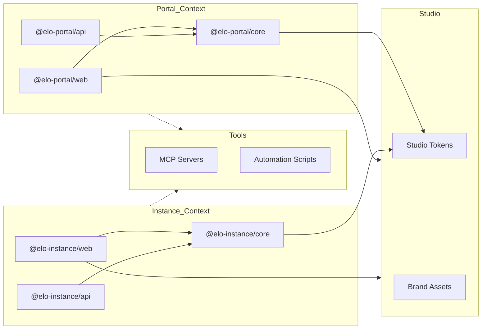

# Technical Architecture

## 1. Executive Summary

Elo Orgânico is an integrated management platform for organic product sharing cycles. The system is built on a **Monorepo** architecture using **PNPM Workspaces** and **Turborepo**, prioritizing high performance, strict typing, and domain isolation through a **Bounded Context** strategy.

The architecture is designed for a **"Singleton Platform / Multi-Tenant Instance"** model, ensuring that the global marketplace and community-specific operations are logically and physically decoupled at the root level.

---

## 2. Monorepo Structure & Application Roles

The codebase is organized into **Domain Contexts** at the root. We distinguish between **Portal (Platform)** and **Instance (Community)**. The following diagram illustrates the package relationships and dependency flow:


```mermaid
graph LR
    subgraph Studio
        S_Tokens["Studio Tokens"]
        S_Assets["Brand Assets"]
    end

    subgraph Tools
        T_MCP["MCP Servers"]
        T_Scripts["Automation Scripts"]
    end

    subgraph Portal_Context
        P_Web["@elo-portal/web"]
        P_API["@elo-portal/api"]
        P_Core["@elo-portal/core"]
    end

    subgraph Instance_Context
        I_Web["@elo-instance/web"]
        I_API["@elo-instance/api"]
        I_Core["@elo-instance/core"]
    end

    P_Web --> P_Core
    P_API --> P_Core
    
    I_Web --> I_Core
    I_API --> I_Core

    P_Core --> S_Tokens
    I_Core --> S_Tokens

    P_Web --> Studio
    I_Web --> Studio

    Portal_Context -.-> Tools
    Instance_Context -.-> Tools
```

| Directory              | Package Name         | Role          | Responsibility                                                 |
| :--------------------- | :------------------- | :------------ | :------------------------------------------------------------- |
| portal/apps/web        | @elo-portal/web      | **Singleton** | Future SaaS onboarding hub skeleton and platform foundation.    |
| portal/apps/api        | @elo-portal/api      | **Singleton** | Global management API foundation, tenant orchestration.        |
| portal/packages/core   | @elo-portal/core     | **Library**   | SSOT for the global platform foundation.                       |
| instance/apps/api      | @elo-instance/api    | **Instance**  | Fastify REST API for a specific community instance.            |
| instance/apps/web      | @elo-instance/web    | **Instance**  | React SPA (Admin/Shop) for a specific community instance.      |
| instance/packages/core | @elo-instance/core   | **Library**   | SSOT for community instances (API & Web App).                  |
| studio/                | @elo-organico/studio | **Tooling**   | Brand tokens, design assets, and global styling.               |
| tools/                 | @elo-organico/tools  | **Tooling**   | MCP infrastructure, automation scripts, and project utilities. |
| knowledge-base/        | @elo-organico/docs   | **Docs Hub**  | Official project documentation hub and technical landing page. |

### 2.1. Bounded Context Philosophy

- **Context Isolation**: Each root directory (`instance/`, `portal/`) represents a Bounded Context. Logic and models are duplicated when necessary to maintain independence, following DDD principles.
- **Deployment**:
  - **Portal**: Designed as a **singleton** layer for future SaaS onboarding. Currently in foundation/skeleton stage.
  - **Knowledge Base**: The **authoritative project hub** for documentation (EloDocs) and technical specifications.
  - **Instance**: Multiple pairs of API/Web will be instantiated in the future SaaS model, one for each community.

---

## 3. Workspace Build & Resolution Strategy

We employ a **Hybrid High-Performance Architecture** optimized by **Turborepo** to manage internal dependencies and task orchestration.

### 3.1. Task Orchestration (Turborepo)

**Turborepo** is the engine behind our monorepo productivity. It handles:
- **Dependency Graph:** Automatically identifying which packages need to be built or checked based on local changes.
- **Infrastructure Coupling:** Orchestrating Docker Compose services as pre-requisites for application development (e.g., `pnpm instance:up` starts databases before the API).
- **Caching:** Speeding up builds, type-checking, and linting by skipping unchanged modules.
- **Unified Outputs:** Standardizing build artifacts into `dist/` (for apps and core) and `build/` (for Docusaurus).

---

## 4. Operational Commands

We use a unified interface in the root `package.json` to manage the entire monorepo. Commands are organized by environment: **development** (local), **production** (live), and **staging** (pre-production testing).

### 4.1. Development

| Command | Description | Orchestration |
| :--- | :--- | :--- |
| `pnpm instance:dev` | Full Community Stack: starts infra, then API and Web locally | Turbo + Docker Compose |
| `pnpm instance:up` | Community infrastructure only (MongoDB Replica Set + Redis) | Docker Compose |
| `pnpm instance:down` | Stops containers and kills local ports (3000, 5173) | Docker Compose + Shell |
| `pnpm instance:reset` | Wipes volumes and restarts dev infrastructure | Docker Compose |
| `pnpm portal:dev` | Full Platform Stack (Foundation) | Turbo + Docker Compose |
| `pnpm portal:up` | Portal infrastructure only (MongoDB + Redis) | Docker Compose |
| `pnpm portal:down` | Stops Portal containers and local ports (3001, 5174) | Docker Compose + Shell |
| `pnpm docs:dev` | Start Knowledge Base (Docusaurus dev server) | PNPM Filter |
| `pnpm typecheck` | Validate TypeScript across the entire monorepo | Turbo |
| `pnpm lint` | Run linting for all workspaces | Turbo |

### 4.2. Production & Staging

Production and staging share the same `compose.prod.yaml` structure — only the `--env-file` flag differs.

| Command | Target | Description |
| :--- | :--- | :--- |
| `pnpm instance:deploy` | Production | Builds and starts Instance stack (API + Web + Redis) using `.env.prod` |
| `pnpm instance:deploy:staging` | Staging | Same stack, uses `.env.staging` (different Atlas cluster and secrets) |
| `pnpm instance:deploy:down` | Prod/Staging | Stops the Instance production stack |
| `pnpm portal:deploy` | Production | Builds and starts Portal stack using `.env.prod` |
| `pnpm portal:deploy:staging` | Staging | Same stack, uses `.env.staging` |
| `pnpm portal:deploy:down` | Prod/Staging | Stops the Portal production stack |

---

## 5. Architectural Principles

- **Single Source of Truth (SSOT):** Community data structures must be defined in `@elo-instance/core`. Platform rules are in `@elo-portal/core`.
- **Inherited Configuration:** ESLint and TSConfig are centralized at the root, with localized extensions providing context-specific refinements without duplicating the base rigor.
- **Domain-Driven Design (DDD) & Feature-Sliced Design (FSD):** The frontend architecture blends DDD bounded contexts with FSD modularity to achieve enterprise scale.
  - **Global Domains (`src/domains`):** Contain entities (e.g., `auth`, `product`, `cycle`), their state stores, API clients, and **Domain Hooks**.
  - **Features (`src/features`):** Represent user workflows or application modules (e.g., `admin`, `shop`). Features orchestrate multiple domains but are strictly isolated from one another.
  - **Feature-Specific Private Domains (`src/features/*/domains`):** Sub-domains that only make sense within a specific feature (e.g., `cart` inside the `shop` feature). This prevents global domain pollution.
  - **Shared UI Layer (`src/shared/ui`):** Reusable, domain-agnostic components (e.g., generic loaders, buttons). Global domains or entities **MUST NOT** import from features.
- **SOLID Principles:**
  - **Single Responsibility:** Logic is separated. Stores handle state, pure functions handle calculations, and hooks handle orchestration.
  - **Open/Closed:** Open for extension, closed for modification.
  - **Liskov Substitution:** Consistent subtype behavior.
  - **Interface Segregation:** Lean, specific interfaces.
  - **Dependency Inversion:** Depend on abstractions, not concretions.

---

## 6. Technology Stack

### 6.1. Package Management & Orchestration

- **Runtime**: Node.js 22+ (LTS).
- **Package Manager**: PNPM v11 (Strict dependency management via symlinks and hard-link content storage).
- **Dependency Management**: **PNPM Catalogs** (Centralized version control for shared dependencies across the workspace using `catalog:` protocol).
- **Task Orchestrator**: **Turborepo** (Optimized caching and parallel execution).
- **Tooling**: TypeScript 6, ESLint 9 (Flat Config), Prettier 3, Vite 8.

### 6.2. Backend (API Layer)

- **Framework**: Fastify v5 (Optimized for high throughput).
- **ORM/ODM**: Mongoose with MongoDB (Replica Set enabled for ACID transactions).
- **Validation**: Zod (Integrated via domain-specific core packages).
- **Processing**: BullMQ + Redis for asynchronous tasks.

### 6.3. Frontend (UI Layer)

- **Framework**: React 19.
- **State Management**: Zustand (Atomic and performant state using Slices and Selectors).
- **Styling**: TailwindCSS v4 + CSS Modules for scoped styles.
- **Animations**: GSAP (High-fidelity interactive feedback).

---

## 7. Architectural Patterns

### 7.1. Layered Responsibilities (Backend)

Each domain follows a strict hierarchy to isolate concerns:
Controller -> Service -> Repository -> Model

- **Controller**: Handles HTTP I/O, route definitions, and Zod schema validation.
- **Service**: Orchestrates business rules, complex logic, and cross-model transactions.
- **Repository**: Abstracts data persistence logic (Repository Pattern) to keep services database-agnostic.
- **Model**: Defines the Mongoose database structure and data integrity rules.

#### Implementation Example (Repository Pattern)

To maintain strict typing and decoupling, repositories receive the Mongoose model via dependency injection.

```typescript
// instance/apps/api/src/domains/auth/auth.repository.ts
import type { Model } from 'mongoose';
import type { IUser } from '@elo-instance/core';

export class AuthRepository {
  constructor(private readonly userModel: Model<IUser>) {}

  async findByEmail(email: string): Promise<IUser | null> {
    return this.userModel.findOne({ email }).exec();
  }

  async create(data: Partial<IUser>): Promise<IUser> {
    return this.userModel.create(data);
  }
}
```

### 7.2. Frontend State Orchestration (Zustand & FSD)

To prevent monolithic stores and unnecessary re-renders in React 19, the frontend adopts a strict **Atomic Selectors Pattern** coupled with **Domain Hooks**:

1. **State vs. Actions Separation**: The Zustand store separates `state` from `actions`. Pure domain logic (like price calculations) is extracted out of the store to maintain the **Single Source of Truth** and testability.
2. **Atomic Selectors**: Monolithic exports (`export const useAuthStore = create(...)`) are wrapped in specific hooks.
3. **Domain Hooks (`src/domains/*/hooks`)**: Selectors are exposed as individual hooks (e.g., `useAuthUser()`, `useProductActions()`). This ensures that a component only re-renders when the exact slice of state it subscribes to changes.

#### Implementation Example (Zustand Atomic Selectors)

```typescript
// instance/apps/web/src/domains/cart/hooks/useCart.ts
import { useCartStore } from '../cart.store';

// Atomic Selectors
export const useCartItems = () => useCartStore((state) => state.items);
export const useCartActions = () => useCartStore((state) => state.actions);

// Derived State Selector (Never stored in state)
export const useCartTotal = () => useCartStore((state) => 
  state.items.reduce((acc, item) => acc + calculateItemPrice(item), 0)
);
```

### 7.3. Dependency Injection

Modular management through Fastify decorators and a centralized registry to decouple components and facilitate testing.

---

## 8. Infrastructure & Deployment

Designed for **Self-Hosted Excellence** on Hetzner Cloud.

### 8.1. Docker Compose Strategy (Dev vs. Production)

Each bounded context (`instance/`, `portal/`) maintains two distinct Compose files with clearly separated responsibilities:

| File | Environment | Services | Database |
| :--- | :--- | :--- | :--- |
| `compose.yaml` | Development | MongoDB Replica Set + Redis | Local Docker container |
| `compose.prod.yaml` | Production & Staging | API + Web/Nginx + Redis | MongoDB Atlas (cloud) |

**Development flow:**
```
pnpm instance:up   →  compose.yaml starts [MongoDB, Redis] in Docker
pnpm instance:dev  →  API (tsx watch) + Web (vite) run on the host
                       API connects to localhost:27017 (MongoDB in Docker)
                       Web proxies /api → localhost:3000 (via Vite proxy)
```

**Production flow:**
```
pnpm instance:deploy  →  compose.prod.yaml builds and starts:
                          [Nginx:80] → [instance-api:3000] → [Redis (internal)]
                                              ↕
                                   [MongoDB Atlas (cloud)]
```

The `compose.prod.yaml` has no MongoDB service by design. In production, the API connects to a cloud-hosted MongoDB Atlas cluster via URI injected from `.env.prod`.

### 8.2. Dockerfile Architecture

Each application owns its `Dockerfile` co-located within its directory, following the **Single Responsibility** and **Bounded Context** principles:

```
instance/apps/api/Dockerfile    # Multi-stage: turbo prune → build → pnpm deploy → runner
instance/apps/web/Dockerfile    # Multi-stage: turbo prune → vite build → nginx:alpine
portal/apps/api/Dockerfile      # Same pattern as instance/api
portal/apps/web/Dockerfile      # Same pattern as instance/web
```

Shared infrastructure services (MongoDB, Redis) have their Dockerfiles in `instance/infrastructure/` because they are cross-app concerns, not owned by any single application.

The API Dockerfiles use **Turborepo pruning** (`turbo prune`) and **`pnpm deploy`** to produce minimal images — no source code, no devDependencies, no monorepo symlinks in production.

The Web Dockerfiles use a two-stage build: a Node.js builder compiles the React SPA via Vite (with `VITE_*` variables injected as Docker `ARG`), and the final stage serves the static output from `nginx:alpine` (~25MB image).

### 8.3. Environment Variable Strategy

Environment files follow the **Bounded Context** and **Single Responsibility** principles — each file has exactly one owner and lives alongside it:

| File | Owner | Purpose | Git |
| :--- | :--- | :--- | :--- |
| `instance/.env.dev` | `compose.yaml` | Infra variable interpolation for dev | ignored |
| `instance/.env.prod` | `compose.prod.yaml` | Infra + `VITE_*` build ARGs for prod | ignored |
| `instance/.env.staging` | `compose.prod.yaml` | Same as prod, different secrets/cluster | ignored |
| `instance/apps/api/.env.dev` | `@elo-instance/api` | Fastify runtime config for dev | ignored |
| `instance/apps/api/.env.prod` | `@elo-instance/api` | Fastify runtime config for prod (Atlas URI) | ignored |
| `instance/apps/web/.env.dev` | `@elo-instance/web` | Vite build-time vars for dev | ignored |
| `*.env.*.example` | All above | Committed templates for onboarding | **tracked** |

`VITE_*` variables (e.g., `VITE_TURNSTILE_SITE_KEY`) are **build-time** only — Vite bakes them statically into the JavaScript bundle during `vite build`. In Docker builds they are passed via `ARG` → `ENV` before the build step runs.

### 8.4. Network & Latency

All components in a deployment stack reside in a private named Docker bridge network (e.g., `elo-instance-network`) for sub-millisecond latency between the API and Redis. The Nginx container is the only service with an external port binding; the API is only reachable via the Nginx reverse proxy on the internal network.

### 8.5. Nginx Configuration

The Web containers (Nginx) handle two concerns:

1. **SPA Routing**: All unknown paths fall back to `index.html` via `try_files $uri $uri/ /index.html`, allowing React Router to handle client-side navigation without 404s on page refresh.
2. **API Reverse Proxy**: Requests to `/api/*` are proxied to the API container using its Docker service name as the hostname (`http://instance-api:3000/`). The trailing slash strips the `/api` prefix before forwarding to Fastify.

---

## 9. Studio & Automation (Architecture)

The studio workspace provides the infrastructure for design-to-code alignment and AI-assisted engineering.

- **Design Alignment**: Integration of self-hosted Penpot with external S3-compatible storage.
- **AI Contextual Bridge**: Use of Model Context Protocol (MCP) servers (Context7, GitHub, Penpot) to expose structured context to AI agents.

---

## 10. Security Standards

Elo Orgânico follows a multi-layered security strategy. For detailed implementation details, refer to the **[Security Architecture](./security.mdx)** document.

- **Bot Protection**: Integration with Cloudflare Turnstile for all authentication entry points.
- **Brute-Force Mitigation**: IP-based rate limiting and account lockout logic.
- **Strict Typing**: TypeScript Strict Mode enabled project-wide.
- **Build Integrity**: Automated build script approvals via `pnpm.onlyBuiltDependencies`.
- **Data Integrity**: MongoDB Replica Set (`rs0`) for transactional reliability and ACID compliance.
- **Validation**: Strict Zod validation at every entry point (API requests, Environment variables, internal contracts).

---

_Last Updated: June 2026_
