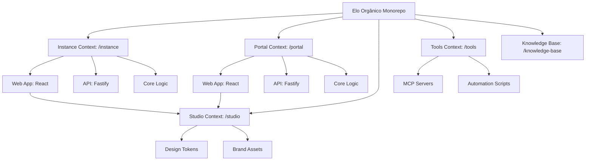

# Introduction

Welcome to the **Elo Orgânico** development environment. This project is a specialized management platform for organic product sharing cycles, built as a high-performance, strictly-typed monorepo.

## Bounded Context Structure

We use **PNPM Workspaces** with a **Context-Driven Root** layout to strictly isolate our business domains. This architecture ensures scalability and clear separation of concerns.



### Instance Context (instance/)
Manages community-specific operations (the "Community Shop").
- **`@elo-instance/web`**: React SPA (Admin & Shop).
- **`@elo-instance/api`**: Fastify REST API.
- **`@elo-instance/core`**: Domain-specific logic and schemas.

### Portal Context (portal/)
Manages the global platform and SaaS onboarding.
- **`@elo-portal/web`**: Official landing page and gatekeeper hub.
- **`@elo-portal/api`**: Global orchestration and tenant management API.
- **`@elo-portal/core`**: Platform-specific logic and schemas.

### Studio Context (studio/)
The single source of truth for the project's visual identity and shared UI tokens.
- **Design Tokens**: Centralized CSS variables and TypeScript constants.
- **Brand Assets**: Canonical logos, icons, and 3D models.
- **AI Orchestration**: Design bridge for AI context.

### Tools Context (tools/)
The automation backbone and infrastructure orchestration hub.
- **MCP Servers**: Model Context Protocol servers (GitHub, Context7, Docker Hub) providing structured context to AI agents.
- **Infrastructure**: Docker configurations and runtime environments for development tools.
- **Automation**: Technical scripts for maintenance, key generation, and workspace health.

---

## Strategic Focus: Single-Instance Mastery

While architected for a future Multi-tenant SaaS model, our current priority is the **perfect delivery of a standalone community instance (instance/*)**. All SaaS features in the `portal-*` scope are foundation-only at this stage.

---

## Quick Start

Ensure you have **Node.js 22+** and **PNPM 11+** installed.

1.  **Install Dependencies:**
    ```bash
    pnpm install
    ```

2.  **Set Up Environment:**
    Copy the `.env.example` to `.env` and configure your local variables.

3.  **Run Development Environment:**
    We use **Turborepo** to orchestrate both infrastructure and application processes in a single lifecycle. For most cases, you should use the unified dev commands:
    ```bash
    pnpm instance:dev       # Orchestrate Community (Infra + Web + API + Core)
    pnpm portal:dev         # Orchestrate Platform (Infra + Web + API + Core)
    ```

    You can also target specific components using our namespaced scripts:
    ```bash
    pnpm docs:dev           # Start Documentation Hub (Docusaurus)
    pnpm instance:web       # Start community shop/admin only
    pnpm instance:api       # Start community API only
    pnpm portal:web         # Start future official portal only
    pnpm portal:api         # Start portal API foundation only
    ```

    Refer to the **[Cheat Sheet](./cheat-sheet.mdx)** for a complete list of commands.

---

## Documentation Index

For detailed guides, please refer to the `docs/` directory:
- **[Architecture Overview](./engineering/architecture.mdx)**: Technical stack and monorepo strategy.
- **[Master Plan](./product/masterplan.mdx)**: Project roadmap and phases.
- **[Product Vision](./product/vision.mdx)**: Product mission and value proposition.
- **[Style Guide](./engineering/styleguide.mdx)**: Coding standards and conventions.

---
_Professional management for a sustainable organic economy._
