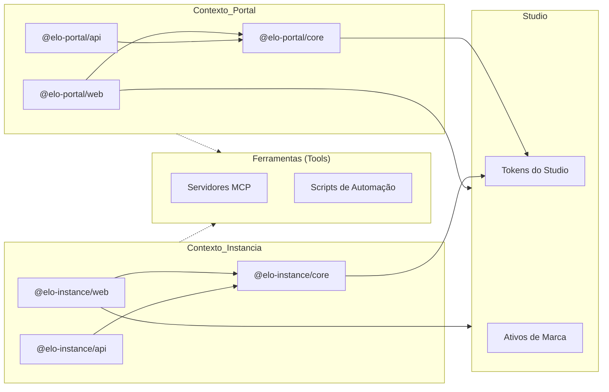

# Arquitetura Técnica

## 1. Resumo Executivo

O Elo Orgânico é uma plataforma de gestão integrada para ciclos de compartilhamento de produtos orgânicos. O sistema é construído sobre uma arquitetura de **Monorepo** utilizando **PNPM Workspaces** e **Turborepo**, priorizando alta performance, tipagem estrita e isolamento de domínio através de uma estratégia de **Contextos Delimitados (Bounded Contexts)**.

A arquitetura é projetada para um modelo de **"Plataforma Singleton / Instância Multi-Tenant"**, garantindo que o marketplace global e as operações específicas de cada comunidade sejam desacoplados lógica e fisicamente no nível raiz.

---

## 2. Estrutura do Monorepo & Papéis das Aplicações

A base de código é organizada em **Contextos de Domínio** na raiz. Distinguimos entre **Portal (Plataforma)** e **Instância (Comunidade)**. O diagrama a seguir ilustra as relações entre os pacotes e o fluxo de dependências:



| Diretório              | Nome do Pacote       | Papel         | Responsabilidade                                               |
| :--------------------- | :------------------- | :------------ | :------------------------------------------------------------- |
| portal/apps/web        | @elo-portal/web      | **Singleton** | Futuro hub de onboarding do SaaS e interface de gestão da plataforma. |
| portal/apps/api        | @elo-portal/api      | **Singleton** | API de gestão global, orquestração de tenants e cobrança.      |
| portal/packages/core   | @elo-portal/core     | **Library**   | SSOT para a plataforma global (Portal API & Web).               |
| instance/apps/api      | @elo-instance/api    | **Instância** | API REST Fastify para uma instância de comunidade específica.  |
| instance/apps/web      | @elo-instance/web    | **Instância** | React SPA (Admin/Loja) para uma instância de comunidade específica. |
| instance/packages/core | @elo-instance/core   | **Library**   | SSOT para instâncias de comunidade (API & Web App).            |
| studio/                | @elo-organico/studio | **Tooling**   | Tokens de marca, ativos de design e estilização global.        |
| tools/                 | @elo-organico/tools  | **Tooling**   | Infraestrutura MCP, scripts de automação e utilitários de projeto. |
| knowledge-base/        | @elo-organico/docs   | **Docs**      | Landing page de documentação do projeto e base de conhecimento técnica. |

### 2.1. Filosofia de Contexto Delimitado (Bounded Context)

- **Isolamento de Contexto**: Cada diretório raiz (`instance/`, `portal/`) representa um Bounded Context. Lógica e modelos são duplicados quando necessário para manter a independência, seguindo princípios de DDD.
- **Implantação (Deployment)**:
  - **Portal**: Existe apenas **uma** instância global da plataforma. Ela servirá como o futuro hub de onboarding SaaS para o ecossistema, enquanto a face pública e landing page do projeto é a Base de Conhecimento (Knowledge Base).
  - **Instância**: Múltiplos pares de API/Web serão instanciados no futuro modelo SaaS, um para cada comunidade.

---

## 3. Estratégia de Build e Resolução de Workspace

Empregamos uma **Arquitetura Híbrida de Alta Performance** otimizada pelo **Turborepo** para gerenciar dependências internas e orquestração de tarefas.

### 3.1. Orquestração de Tarefas (Turborepo)

O **Turborepo** é o motor por trás da nossa produtividade no monorepo. Ele lida com:
- **Grafo de Dependências:** Identifica automaticamente quais pacotes precisam de build ou validação com base em alterações locais.
- **Acoplamento de Infraestrutura:** Orquestra serviços do Docker Compose como pré-requisitos para o desenvolvimento das aplicações (ex: iniciar bancos de dados antes da API).
- **Caching:** Acelera builds e lints ao ignorar módulos que não foram alterados.

### 3.2. Aplicações Web (Build do Código-Fonte)

As aplicações frontend utilizam uma estratégia de **"Bundling from Source"**.

- **Mecanismo:** O Vite 8 aproveita o `resolve.tsconfigPaths` nativo para resolver aliases diretamente para o `src` dos pacotes internos (ex: `@elo-instance/core` aponta para `instance/packages/core/src/index.ts`).
- **Benefícios:** Máxima eficiência de tree-shaking (o Vite otimiza o código do Core especificamente para o bundle da app), HMR instantâneo em todo o monorepo e pipelines de build simplificados.

### 3.2. APIs Backend (Híbrido Source-to-Package)

As APIs utilizam uma estratégia de resolução em dois níveis para manter a compatibilidade com o runtime do Node.js.

- **Desenvolvimento:** O `tsx` resolve aliases para o `src` do Core para feedback em tempo real sem pré-compilação.
- **Produção:** O `tsconfig.build.json` limpa explicitamente os paths, forçando o compilador TypeScript e o Node.js a resolver dependências via `node_modules` (simbolicamente vinculados pelo PNPM).
- **Requisito:** Pacotes Core devem ter o build concluído (`pnpm build`) antes de iniciar a API em modo de produção.

---

## 4. Princípios Arquiteturais

- **Fonte Única de Verdade (SSOT):** Estruturas de dados da comunidade devem ser definidas em `@elo-instance/core`. Regras da plataforma estão em `@elo-portal/core`.
- **Configuração Herdada:** ESLint e TSConfig são centralizados na raiz, com extensões localizadas fornecendo refinamentos específicos de contexto sem duplicar o rigor base.
- **Domain-Driven Design (DDD):** A lógica de negócio é organizada em domínios (`auth`, `cycle`, `product`) para facilitar a modularidade.
  - **Isolamento Estrito de Domínio:** Importações entre contextos (ex: Portal importando da Instância) são estritamente proibidas via regras de ESLint para evitar vazamentos arquiteturais.
- **Princípios SOLID:**
  - **Responsabilidade Única:** Cada módulo tem um propósito específico.
  - **Aberto/Fechado:** Aberto para extensão, fechado para modificação.
  - **Substituição de Liskov:** Comportamento consistente de subtipos.
  - **Segregação de Interface:** Interfaces enxutas e específicas.
  - **Inversão de Dependência:** Depender de abstrações, não de concreções.

---

## 5. Stack Tecnológica

### 5.1. Gestão de Pacotes & Orquestração

- **Runtime**: Node.js 22+ (LTS).
- **Gerenciador de Pacotes**: PNPM v10 (Gestão estrita de dependências).
- **Gestão de Dependências**: **PNPM Catalogs** (Controle de versão centralizado para dependências compartilhadas usando o protocolo `catalog:`).
- **Orquestrador de Tarefas**: **Turborepo** (Cache otimizado e execução paralela).
- **Tooling**: TypeScript 6, ESLint 9 (Flat Config), Prettier 3, Vite 8.

### 5.2. Backend (Camada de API)

- **Framework**: Fastify v5 (Otimizado para alto throughput).
- **ORM/ODM**: Mongoose com MongoDB (Replica Set ativado para transações ACID).
- **Validação**: Zod (Integrado via pacotes core específicos de domínio).
- **Processamento**: BullMQ + Redis para tarefas assíncronas.

### 5.3. Frontend (Camada de UI)

- **Framework**: React 19.
- **Gestão de Estado**: Zustand (Estado atômico e performático).
- **Estilização**: TailwindCSS v4 + CSS Modules para estilos escopados.
- **Animações**: GSAP (Feedback interativo de alta fidelidade).

---

## 6. Padrões Arquiteturais

### 6.1. Camadas de Responsabilidade (Backend)

Cada domínio segue uma hierarquia estrita para isolar preocupações:
Controller -> Service -> Repository -> Model

- **Controller**: Gerencia I/O HTTP, definições de rota e validação de esquemas Zod.
- **Service**: Orquestra regras de negócio, lógica complexa e transações entre modelos.
- **Repository**: Abstrai a lógica de persistência de dados (Repository Pattern) para manter os serviços independentes do banco de dados.
- **Model**: Define a estrutura do banco de dados Mongoose e as regras de integridade de dados.

#### Exemplo de Implementação (Repository Pattern)

Para manter a tipagem estrita e o desacoplamento, os repositórios recebem o modelo Mongoose via injeção de dependência.

```typescript
// instance/apps/api/src/domains/auth/auth.repository.ts
import type { Model } from 'mongoose';
import type { IUser } from '@elo-instance/core';

export class AuthRepository {
  constructor(private readonly userModel: Model<IUser>) {}

  async findByEmail(email: string): Promise<IUser | null> {
    return this.userModel.findOne({ email }).exec();
  }

  async create(data: Partial<IUser>): Promise<IUser> {
    return this.userModel.create(data);
  }
}
```

### 6.2. Injeção de Dependência

Gestão modular através de decoradores do Fastify e um registro centralizado para desacoplar componentes e facilitar testes.

---

## 7. Infraestrutura & Implantação

Projetado para **Excelência Self-Hosted** na Hetzner Cloud.

### 7.1. Orquestração

- **Docker Compose**: Orquestra todo o stack (Apps, DB, Cache, servidores MCP).
- **Nginx**: Opera como Proxy Reverso e servidor de arquivos estáticos para builds de produção.

### 7.2. Rede & Latência

Todos os componentes residem em uma rede privada do Docker para latência sub-milissegundo entre APIs e Bancos de Dados.

---

## 8. Studio & Automação (Arquitetura)

O workspace de studio fornece a infraestrutura para o alinhamento entre design e código e engenharia assistida por IA.

- **Alinhamento de Design**: Integração do Penpot self-hosted com armazenamento externo compatível com S3.
- **Ponte Contextual de IA**: Uso de servidores Model Context Protocol (MCP) (Context7, GitHub, Penpot) para expor contexto estruturado a agentes de IA.

---

## 9. Padrões de Segurança

- **Tipagem Estrita**: Modo Estrito do TypeScript ativado em todo o projeto.
- **Integridade de Build**: Aprovações automatizadas de scripts de build via `pnpm.onlyBuiltDependencies`.
- **Integridade de Dados**: MongoDB Replica Set (`rs0`) para confiabilidade transacional e conformidade ACID.
- **Validação**: Validação rigorosa com Zod em cada ponto de entrada (Requisições API, Variáveis de ambiente, contratos internos).

---

_Última Atualização: Abril de 2026_
