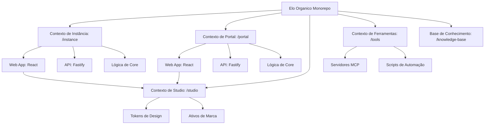

# Introdução

Bem-vindo ao ambiente de desenvolvimento do **Elo Orgânico**. Este projeto é uma plataforma de gestão especializada para ciclos de compartilhamento de produtos orgânicos, construída como um monorepo de alta performance e tipagem estrita.

## Estrutura de Contextos Delimitados (Bounded Contexts)

Utilizamos **PNPM Workspaces** com um layout de **Context-Driven Root** para isolar estritamente nossos domínios de negócio. Esta arquitetura garante escalabilidade e uma separação clara de responsabilidades.



### Contexto de Instância (instance/)
Gerencia as operações específicas da comunidade (a "Loja da Comunidade").
- **`@elo-instance/web`**: React SPA (Admin & Loja).
- **`@elo-instance/api`**: Fastify REST API.
- **`@elo-instance/core`**: Lógica e esquemas específicos do domínio.

### Contexto de Portal (portal/)
Gerencia a plataforma global e o onboarding do SaaS.
- **`@elo-portal/web`**: Landing page oficial e hub de entrada.
- **`@elo-portal/api`**: API de orquestração global e gestão de tenants.
- **`@elo-portal/core`**: Lógica e esquemas específicos da plataforma.

### Contexto de Studio (studio/)
A fonte única de verdade para a identidade visual do projeto e tokens de UI compartilhados.
- **Tokens de Design**: Variáveis CSS e constantes TypeScript centralizadas.
- **Ativos de Marca**: Logos canônicos, ícones e modelos 3D.
- **Orquestração de IA**: Ponte de design para contexto de IA.

### Contexto de Ferramentas (tools/)
A espinha dorsal de automação e hub de orquestração de infraestrutura.
- **Servidores MCP**: Servidores Model Context Protocol (GitHub, Context7, Docker Hub) que fornecem contexto estruturado para agentes de IA.
- **Infraestrutura**: Configurações Docker e ambientes de runtime para ferramentas de desenvolvimento.
- **Automação**: Scripts técnicos para manutenção, geração de chaves e saúde do workspace.

---

## Foco Estratégico: Maestria em Instância Única

Embora arquitetado para um modelo SaaS Multi-tenant futuro, nossa prioridade atual é a **entrega perfeita de uma instância de comunidade autônoma (instance/*)**. Todas as funcionalidades SaaS no escopo `portal-*` são apenas fundacionais nesta etapa.

---

## Início Rápido

Certifique-se de ter o **Node.js 22+** e o **PNPM 11+** instalados.

1.  **Instalar Dependências:**
    ```bash
    pnpm install
    ```

2.  **Configurar Ambiente:**
    Copie o arquivo `.env.example` para `.env` e configure suas variáveis locais.

3.  **Executar Ambiente de Desenvolvimento:**
    Utilizamos o **Turborepo** para orquestrar tanto a infraestrutura quanto os processos da aplicação em um único ciclo de vida. Na maioria dos casos, você deve usar os comandos unificados:
    ```bash
    pnpm instance:dev       # Orquestrar Comunidade (Infra + Web + API + Core)
    pnpm portal:dev         # Orquestrar Plataforma (Infra + Web + API + Core)
    ```

    Você também pode direcionar componentes específicos usando nossos scripts com namespace:
    ```bash
    pnpm docs:dev           # Iniciar Documentation Hub (Docusaurus)
    pnpm instance:web       # Iniciar apenas loja/admin da comunidade
    pnpm instance:api       # Iniciar apenas API da comunidade
    pnpm portal:web         # Iniciar apenas futuro portal oficial
    pnpm portal:api         # Iniciar apenas API do portal (foundation)
    ```

    Consulte o **[Cheat Sheet](./cheat-sheet.mdx)** para uma lista completa de comandos.

---

## Índice de Documentação

Para guias detalhados, consulte o diretório `docs/`:
- **[Visão Geral da Arquitetura](./engineering/architecture.mdx)**: Stack técnica e estratégia de monorepo.
- **[Plano Mestre](./product/masterplan.mdx)**: Roadmap e fases do projeto.
- **[Visão do Produto](./product/vision.mdx)**: Missão do produto e proposta de valor.
- **[Guia de Estilo](./engineering/styleguide.mdx)**: Padrões de codificação e convenções.

---
_Gestão profissional para uma economia orgânica sustentável._
