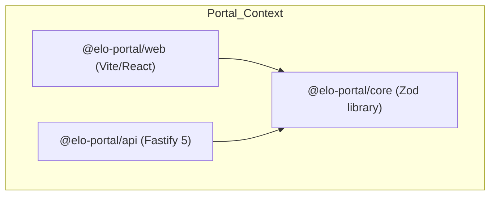

# Bounded Context Context: Portal (Platform Stack)

This file defines the domain rules, local stack services, and workspace structure for the global platform-wide **Portal Bounded Context** (`portal/`).

---

## Bounded Context Navigation

Before editing or analyzing code in this platform context, read the local rules for the specific workspace:

- **Core Library**: [packages/core/AGENTS.md](./packages/core/AGENTS.md) — Platform types, validation schemas, and contracts.
- **REST API**: [apps/api/AGENTS.md](./apps/api/AGENTS.md) — Fastify platform endpoints, billing logic, and tenant registries.
- **Web Client**: [apps/web/AGENTS.md](./apps/web/AGENTS.md) — React dashboard for global administration and user onboarding.

---

## Bounded Context Architecture

The Portal context represents the **Global Platform layer** (SaaS Hub) designed to manage multi-tenant community instances. 

> [!NOTE]
> This context is currently in the **foundation/skeleton stage** of development. Our immediate strategic focus is "Single-Instance Mastery" (`instance/` stack). Portal features should remain foundational and not introduce runtime complex SaaS logic until instance stability is reached.

- **Domain Scope**: Handles platform administration, SaaS subscription tiers, tenant registration, global authentication, and Stripe billing integrations.
- **Infrastructure separation**: Boots database and caching services on distinct ports (`27018` for MongoDB, `6380` for Redis) to co-exist with the community development stack without conflicts.

---

## Context Isolation Guardrails

1. **No Cross-Context Imports**: You MUST NEVER import modules, constants, validation schemas, or helper functions from the `instance/` directory. The portal and instance domains are strictly isolated to protect multi-tenant integrity.
2. **Catalog Integrity**: Always declare dependencies using the workspace catalogs (`catalog:web-stack`, `catalog:api-stack`, etc.) defined in `pnpm-workspace.yaml`.

---

## Local Lifecycle Commands

Run these commands from the monorepo root to manage the platform stack:

- `pnpm portal:dev`: Boots the local compose databases (MongoDB + Redis), builds `@elo-portal/core`, and runs `@elo-portal/api` and `@elo-portal/web` concurrently on the host.
- `pnpm portal:up`: Boots only the Portal MongoDB (`elo-portal-db-dev`) and Redis (`elo-portal-redis-dev`) containers.
- `pnpm portal:down`: Stops local Portal Docker containers and releases localhost ports 3001 and 5174.
- `pnpm portal:prod`: Builds and launches the production platform stack using `.env.prod`.
- `pnpm portal:staging`: Builds and launches the staging platform stack using `.env.staging`.
