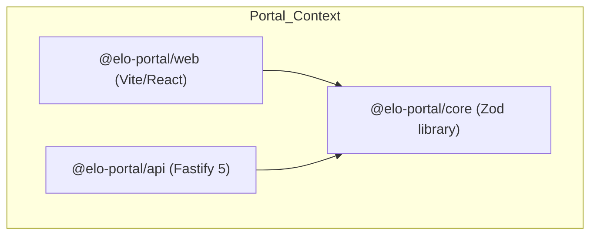

# Bounded Context: Portal (Global Hub)

This file defines the domain rules, local stack services, and workspace structure for the platform-specific **Portal Bounded Context** (`portal/`).

---

## Bounded Context Navigation

Before editing or analyzing code in this context, read the local rules for the specific workspace:

- **Core Library**: [packages/core/AGENTS.md](./packages/core/AGENTS.md) — Shared types, Zod schemas, and data validation rules for the Portal domain.
- **REST API**: [services/api/AGENTS.md](./services/api/AGENTS.md) — Fastify 5 route definitions, Mongoose models, and central orchestration logic.
- **Web Client**: [services/web/AGENTS.md](./services/web/AGENTS.md) — React 19 visual client, Zustand state stores, and global dashboard interfaces.
- **Workspace Roadmap**: Refer to the portal roadmap in [../docs/roadmap/03-portal.mdx](../docs/roadmap/03-portal.mdx).

---

## Bounded Context Architecture

The Portal context manages all global-level operations (platform hub, billing, supplier dashboards). It is architected for strict domain isolation and scalability.

- **Canonical Database**: The database connection parses Mongoose connection strings for the global platform hub.
- **State & Action Segregation**: State management in the client strictly separates properties from actions in Zustand stores, exporting atomic selectors.

---

## Context Isolation Guardrails

1. **No Cross-Context Imports**: You MUST NEVER import modules, constants, validation schemas, or helper functions from the `instance/` directory. All shared utilities or assets must be locally duplicated or centralized in global tooling workspaces if permitted. You must strictly use `@elo-portal/core`.
2. **Catalog Integrity**: All dependencies must declare versions using workspace catalogs defined in `pnpm-workspace.yaml`.

---

## Local Lifecycle Commands

Run these commands from the monorepo root to manage the portal stack:

- `pnpm portal:dev`: Boots the local compose databases, builds `@elo-portal/core`, and runs `@elo-portal/api` and `@elo-portal/web` concurrently.
- `pnpm portal:up`: Boots only the MongoDB and Redis containers for the portal.
- `pnpm portal:down`: Stops local Docker containers and releases ports.
