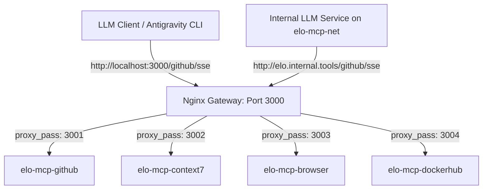

# Elo Organico - Model Context Protocol (MCP) Gateway

This directory contains the Dockerized gateway and server environment for Model Context Protocol (MCP) services. It is designed to work out of the box in local development environments and scale to containerized cloud deployments (e.g., Docker Compose, Swarm, or Kubernetes on VPS hosts).

## Architecture Overview

The system uses a hub-and-spoke gateway model:

1. **Nginx Reverse Proxy (Gateway):** Acts as the single entrypoint on port 3000 (external) and port 80 (internal to the network). It routes path prefixes (e.g., `/github/*`) to individual MCP backend adapters.
2. **Node.js SSE & Streamable-HTTP Adapters:** Native, zero-dependency Node.js wrappers (`sse-adapter.js`) that translate incoming HTTP POST/GET requests into stdio streams for the CLI-based MCP servers, implementing the MCP Server-Sent Events (SSE) standard.
3. **Bridge Network Routing:** Containers communicate internally over a dedicated Docker bridge network named `elo-mcp-net`. The gateway is aliased as `elo.internal.tools` on this network.



## Internal Network Connectivity (Cloud & Dev)

For deployments where LLM runners, AI agents, or backend services run within the same Docker environment (e.g., on a cloud VPS), they can attach directly to the network and communicate internally.

### Network Specification
* **Network Name:** `elo-mcp-net` (declared explicitly in `compose.yaml`).
* **Gateway Host Alias:** `elo.internal.tools`.

### How to Attach External Services (e.g., LLM containers)
To attach an LLM runner stack or another compose file to the same network, define it as an external network in your service's `compose.yaml`:

```yaml
services:
  llm-runner:
    image: ollama/ollama
    networks:
      - elo-mcp-net

networks:
  elo-mcp-net:
    external: true
```

Inside the LLM runner container, the MCP services can then be configured using the internal unified domain:
* GitHub: `http://elo.internal.tools/github/sse`
* Context7: `http://elo.internal.tools/context7/sse`
* Playwright Browser: `http://elo.internal.tools/browser/sse`
* Docker Hub: `http://elo.internal.tools/dockerhub/sse`

No port mappings (e.g., `:3000`) are required internally because the gateway listens on standard HTTP port 80.

---

## Configuration

Secrets and settings are managed using environment files in the `config/` directory.

### Setup
Copy the example files and populate them with your credentials:
```bash
cp config/.env.github.example config/.env.github
cp config/.env.context7.example config/.env.context7
cp config/.env.browser.example config/.env.browser
cp config/.env.dockerhub.example config/.env.dockerhub
```

### Reference Variables
* `.env.github`: `GITHUB_PERSONAL_ACCESS_TOKEN` (Requires permissions: repo, read:org, gist, workflow).
* `.env.context7`: `CONTEXT7_API_KEY` (Your Upstash Context7 API key).
* `.env.dockerhub`: `HUB_PAT_TOKEN` (Read-only token) and `HUB_USERNAME` (Optional, for repository write operations).

---

## Orchestration Commands

Manage the MCP stack using global commands defined in the root `package.json`:

* **Start the stack:**
  ```bash
  pnpm mcp:up
  ```
* **Stop the stack:**
  ```bash
  pnpm mcp:down
  ```
* **Rebuild and restart (apply configuration changes):**
  ```bash
  pnpm mcp:reset
  ```

---

## Client Integration

For local development tools (like Google Antigravity CLI running directly on the host machine), update your `.agents/mcp_config.json` configuration as follows:

```json
{
  "mcpServers": {
    "github": {
      "url": "http://localhost:3000/github/sse",
      "lifecycle": "eager"
    },
    "context7": {
      "url": "http://localhost:3000/context7/sse",
      "lifecycle": "eager"
    },
    "browser": {
      "url": "http://localhost:3000/browser/sse",
      "lifecycle": "eager"
    },
    "dockerhub": {
      "url": "http://localhost:3000/dockerhub/sse",
      "lifecycle": "eager"
    }
  }
}
```
